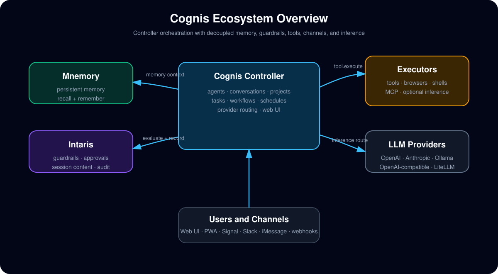

# cognis

Decoupled control plane for AI agents. Cognis is the controller and orchestration layer of the Openclaw ecosystem -- it manages agent definitions, interactive chat, delegated sub-sessions, tool execution routing, and integrates with external memory and guardrails services.

**Non-blocking.** The main chat is always responsive. Heavy work -- research, coding, multi-step tool calls -- is delegated to background sub-sessions. The user sees real-time progress and can continue chatting.

**Decoupled.** Cognis does not embed memory, guardrails, or session recording. It orchestrates them through pluggable provider interfaces. Swap any component without changing the controller.

**Safe by default.** Every tool call flows through guardrails evaluation. Non-bypassable tools always require safety checks. All actions are audited with full lineage.

**Self-hosted.** Python async controller, SQLite or PostgreSQL, no external dependencies beyond an LLM API key and the companion services. Your agents, conversations, and data stay under your control.

Part of the Openclaw ecosystem: Cognis controller, [Intaris](https://github.com/fpytloun/intaris) guardrails, [Mnemory](https://github.com/fpytloun/mnemory) memory.

## Features

- **Interactive chat with streaming** -- WebSocket-based chat with real-time token streaming, tool call indicators, and delegation status cards.
- **Agent identity** -- Create agents with name, personality, behavioral rules, and skills. Personality bootstrapped to Mnemory and evolves through interactions.
- **Sub-session delegation** -- Three modes: Agent (delegate to different agent), Worker (same agent, focused task), Fork (parallel exploration). Main chat stays responsive.
- **Task queue + workflows** -- Durable kanban-style tasks with priorities, dependencies, portable workflow templates, step evaluation, and human-in-the-loop gates.
- **Controller-executor separation** -- The controller decides; executors do. Ships with in-process, subprocess, and remote WebSocket executors using JSON-RPC 2.0 over WebSocket. Remote executors can provide local LLM inference (ollama, vllm) alongside tool execution, and the planned channel model allows executor-hosted adapters for platforms that need user-local services such as Signal via `signal-cli`.
- **Memory integration** -- Persistent recall and remember through [Mnemory](https://github.com/fpytloun/mnemory). Agent identity, user facts, episodic memory, and artifacts.
- **Guardrails integration** -- Every tool call evaluated by [Intaris](https://github.com/fpytloun/intaris). Escalation prompts with approve/deny. Session recording and behavioral analysis.
- **LLM provider abstraction** -- Multi-provider support via LiteLLM. Configure providers and model routing through the UI. Cost tracking per agent and task.
- **MCP tool support** -- Connect any MCP server. Tools discovered automatically, evaluated through guardrails, executed on the executor.
- **Decision Engine** -- Deterministic rules + lightweight LLM classifier decide whether a request runs inline or gets delegated to a background sub-session.
- **Context management** -- Parallel context assembly (Mnemory recall + Intaris events + intention read via `asyncio.gather`). LLM-based compaction with mechanical fallback for long conversations.
- **Web UI** -- SvelteKit application served by Cognis on `:8080` by default, with setup flow, diagnostics, provider presets, and account management.
- **Channel adapters** -- Connect agents to Signal, WhatsApp, Telegram, Discord, Slack, Matrix, IRC, Google Chat, and iMessage (via BlueBubbles) with DB-managed channel accounts and webhook/gateway integrations.
- **Secure pairing flow** -- External senders can be required to redeem a short-lived verification code in the Cognis UI before the agent accepts their messages.
- **Polished workspace UX** -- Global toasts, confirmation dialogs, keyboard shortcuts, mobile navigation, chat timestamps, and unsaved-change protection.
- **Degraded-mode guidance** -- Provider outage banners, setup-incomplete states, retry affordances, and contextual chat/task failure messaging.
- **CLI** -- Typer-based CLI for server management and administration.
- **Quick local bootstrap** -- `uvx cognis` creates local keys and a SQLite database, then serves the web UI on `:8080`.
- **JWT service auth** -- Cognis issues ES256 JWTs. Mnemory and Intaris validate them. No API keys between services.
- **Encrypted secrets** -- AES-256-GCM encrypted secret store for API keys and credentials. Injected into executors at runtime.

## Quick Start

### Prerequisites

- Python 3.12+
- One LLM option: OpenAI, Anthropic, or a local Ollama instance

Cognis needs [Mnemory](https://github.com/fpytloun/mnemory) and [Intaris](https://github.com/fpytloun/intaris) running. Each is a single command:

```bash
uvx mnemory                     # Memory layer on :8050
uvx intaris                     # Guardrails on :8060
uvx cognis                      # Controller on :8080
```

Point Mnemory and Intaris at Cognis's public key for JWT validation:

```bash
# Mnemory
MNEMORY_JWT_PUBLIC_KEY=~/.cognis/keys/public.pem uvx mnemory

# Intaris
INTARIS_JWT_PUBLIC_KEY=~/.cognis/keys/public.pem uvx intaris
```

Start Cognis with an LLM credential available to LiteLLM:

```bash
OPENAI_API_KEY=sk-... uvx cognis
```

On first start, Cognis creates `~/.cognis/` with auto-generated JWT keys, a secrets encryption key, and a SQLite database. When bundled UI assets are present, it serves the web UI on `:8080` and prints a one-time setup URL for the first admin account:

```
Cognis started on http://localhost:8080

No users found. Complete setup at:
  http://localhost:8080/setup?token=<random_token>
This link expires in 15 minutes.
```

After creating the admin:

1. Open the printed setup URL
2. Create the first admin account in the web form
3. Log in
4. Open **Settings → Providers** and configure a provider preset
5. Open **Agents → New** and create the first agent
6. Start a conversation from **Chat**
7. Optional: configure **Channels** and redeem pairing codes to link remote sender identities securely

Use **Settings → System** or **Getting started** for readiness checks and diagnostics.

The bundled UI also includes embedded user-facing documentation under `Docs`.

For headless setup, use the CLI:

```bash
cognis admin create-user admin@example.com --name "Admin"
```

## Architecture

Cognis is a decoupled control plane. It orchestrates, but does not own, memory or guardrails:



| Data | Owner | Storage |
|------|-------|---------|
| Users, agents, secrets, settings | **Cognis** | Cognis DB (SQLite / PostgreSQL) |
| Conversation & session metadata | **Cognis** | Cognis DB |
| Session content (messages, tool calls) | **Intaris** | Intaris event store |
| Safety decisions, behavioral analysis | **Intaris** | Intaris DB |
| Persistent memory (facts, personality) | **Mnemory** | Mnemory (Qdrant) |

Every major capability is a pluggable provider behind a Python `Protocol` interface:

- `MemoryProvider` -- default: Mnemory
- `GuardrailsProvider` -- default: Intaris
- `ExecutorProvider` -- default: in-process (Docker, K8s in Phase 2)
- `LLMProvider` -- default: LiteLLM
- `SecretsProvider` -- default: encrypted DB
- `AuthProvider` -- default: ES256 JWT

## Configuration

There is **no configuration file**. Infrastructure config uses environment variables. Application config (LLM providers, model routing, session settings) is stored in the database and managed through the UI or API.

### Environment Variables

| Variable | Default | Description |
|----------|---------|-------------|
| `COGNIS_DATA_DIR` | `~/.cognis` | Data directory (keys, DB, secrets) |
| `COGNIS_HOST` | `0.0.0.0` | Bind address |
| `COGNIS_PORT` | `8080` | Port |
| `COGNIS_MNEMORY_URL` | `http://localhost:8050` | Mnemory service URL |
| `COGNIS_INTARIS_URL` | `http://localhost:8060` | Intaris service URL |
| `DATABASE_URL` | `sqlite+aiosqlite:///~/.cognis/cognis.db` | Database URL |
| `COGNIS_LOG_LEVEL` | `info` | Log level |

Auto-generated on first start (override with env vars for production):
- `COGNIS_JWT_PRIVATE_KEY_PATH` -- ES256 private key
- `COGNIS_JWT_PUBLIC_KEY_PATH` -- ES256 public key (share with Mnemory/Intaris)
- `COGNIS_SECRETS_KEY_PATH` -- AES-256-GCM encryption key

## Development

```bash
# Install with dev dependencies
uv pip install -e ".[dev]"

# Run server
uv run cognis serve

# Run the SvelteKit UI in dev mode (not required for normal users)
cd ui && npm install && npm run dev

# Run tests
uv run pytest tests/unit/ -v          # Unit tests (fast, no services needed)
uv run pytest tests/contract/ -v      # Contract tests (need Mnemory + Intaris)
uv run pytest tests/integration/ -v   # Integration tests (need full stack)

# UI checks and build
cd ui && npm run check
cd ui && npm run test
cd ui && npm run build

# Lint and type check
ruff check cognis/ tests/
ruff format cognis/ tests/
mypy cognis/
```

## CLI

```bash
cognis serve                            # Start the controller
cognis admin create-user <email>        # Create user (direct DB access)
cognis admin reset-password <email>     # Reset password
cognis admin api-key create <email>     # Create API key
cognis status                           # Health + provider status
cognis config init                      # Print env var template
cognis executor run --controller-url wss://... --token ...
                                        # Run standalone executor process
```

### Remote Executor

Run a standalone executor process that connects to a Cognis controller via WebSocket. The executor is a remote hand: the controller assigns tools, MCP setup, and decides whether LLM inference runs locally on the controller or is proxied through the executor.

```bash
# On the remote machine (via CLI flags)
cognis executor run \
    --controller-url wss://cognis.example.com/api/executor/ws \
    --token <jwt-token>

# Or via environment variables (preferred — avoids token in /proc/cmdline)
export COGNIS_CONTROLLER_URL=wss://cognis.example.com/api/executor/ws
export COGNIS_EXECUTOR_TOKEN=<jwt-token>
cognis executor run
```

Or run as a Python module:
```bash
python -m cognis.executor \
    --controller-url wss://cognis.example.com/api/executor/ws \
    --token <jwt-token>
```

The executor authenticates with a JWT token generated by Cognis, communicates over encrypted WebSocket with per-message compression, and sends heartbeats every 15 seconds. TLS (`wss://`) is enforced for non-localhost connections. LLM providers remain configured normally in Cognis; setting a provider location to `executor` routes the same provider call through a matching executor instead of running it on the controller.

Executors are user-scoped. MCP servers are also user-scoped and are assigned to executors, not shared globally across users. Agents bind to one executor (explicitly or by labels) and inherit the effective tool set from that executor.

For multi-user production deployments, disable local executor modes with the DB-backed settings `executors.allow_in_process=false` and `executors.allow_subprocess=false`, then use only WebSocket executors.

**Generating a token:** Create the executor in **Settings > Executors**, then click **Generate token**. The token is displayed once — copy it or the ready-made CLI command. Alternatively, use the API: `POST /api/v1/executors/{id}/token` (admin only).

**Subprocess mode:** When using `python -m cognis.executor`, the token can also be piped via stdin (used internally by the subprocess executor to avoid exposing the token in process listings).

**Systemd service templates** for both the controller and executor are available in [`deploy/systemd/`](deploy/systemd/). See [`deploy/systemd/README.md`](deploy/systemd/README.md) for installation instructions covering system-level units (per-user executor template) and user-level units (no root required).

The same split is the deployment model for stateful channel adapters.
For example, a user can either run Signal's `signal-cli` REST API next to a
Cognis executor they control or let the executor run `signal-cli` directly via
JSON-RPC, while the cloud controller continues to orchestrate pairing, turns,
and outbound delivery without owning the Signal session state itself.

## Roadmap

- **Phase 1 (MVP)** -- Interactive chat, background task queue + workflows, Mnemory/Intaris integration, SvelteKit UI, in-process executor, remote WebSocket executors, executor-side LLM inference
- **Phase 2** -- Multi-agent, Docker/K8s executors, chat platform integrations, executor-hosted channel adapters for user-local services, scheduler
- **Phase 3** -- A2A federation, cryptographic agent identity, multi-tenant production deployment

See [docs/specs/](docs/specs/) for the full specification set and [docs/specs/implementation/](docs/specs/implementation/) for the implementation stage tracker.

## Documentation

- [Documentation Index](docs/README.md)
- [Getting Started](docs/guide/getting-started.md)
- [Architecture](docs/guide/architecture.md)
- [Configuring Providers](docs/guide/configuring-providers.md)
- [Creating Agents](docs/guide/creating-agents.md)
- [Settings](docs/guide/settings.md)
- [Using Chat](docs/guide/using-chat.md)
- [Managing Tasks](docs/guide/managing-tasks.md)
- [Workflows](docs/guide/workflows.md)
- [Channels](docs/guide/channels.md)
- [Executors](docs/guide/executors.md)
- [Tools and Skills](docs/guide/tools-and-skills.md)
- [Troubleshooting](docs/guide/troubleshooting.md)

## License

Business Source License 1.1, same licensing model as Intaris.

- Free for your own internal business operations, including internal deployment
- Modifications and redistribution allowed when not used commercially
- Converts to Apache License 2.0 on 2030-03-15

See [`LICENSE`](LICENSE) for the full terms.
