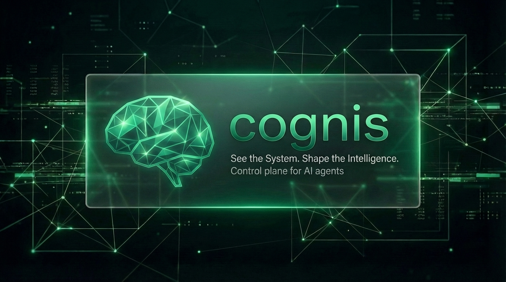
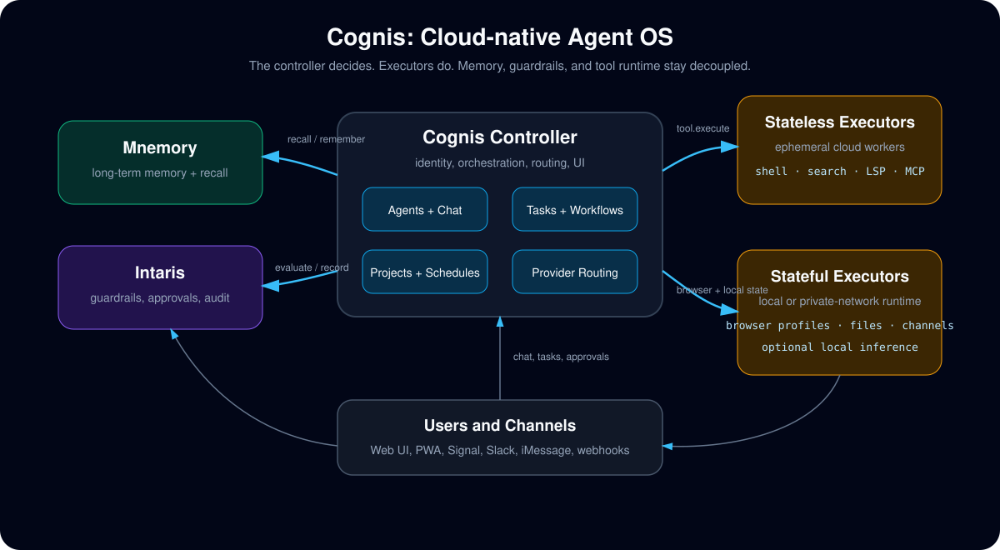
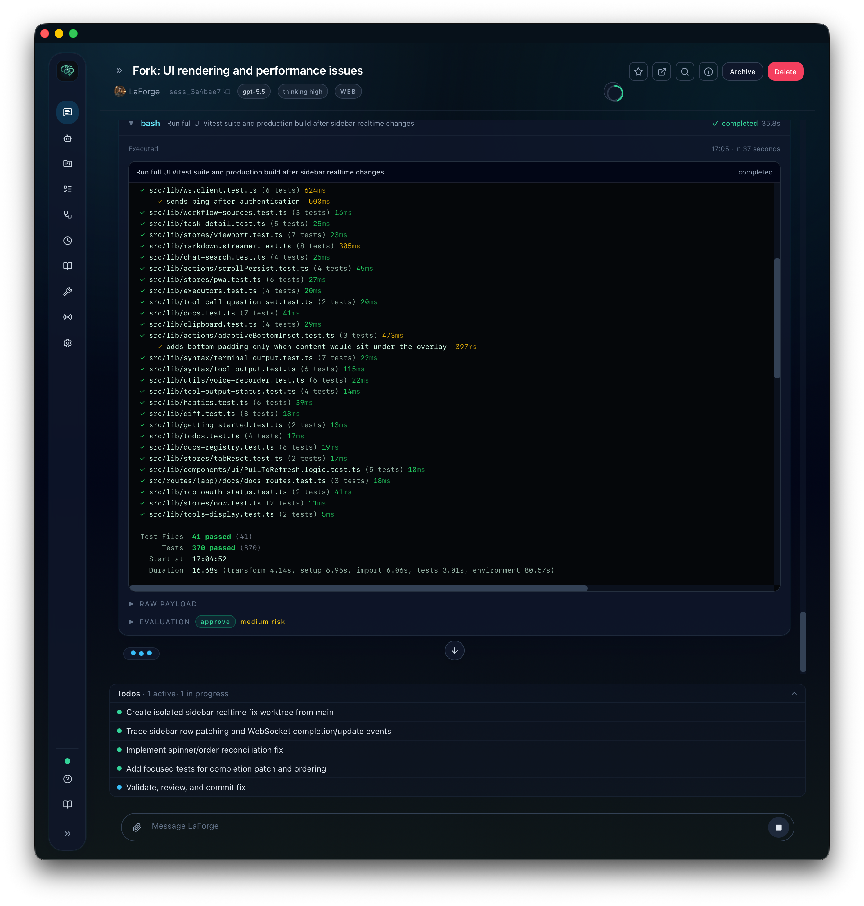
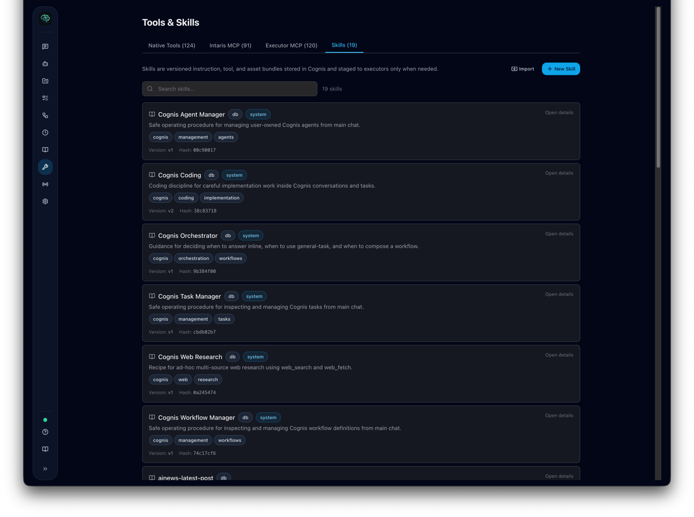
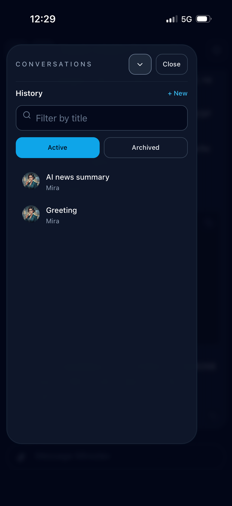

<p align="center">
  
</p>

# cognis

**Cloud-native Agent OS for self-hosted AI agents.** Cognis gives agents identity, memory, workflows, tools, browser use, channels, and safety guardrails without turning everything into one fragile monolith.

Cognis separates the **controller** from **executors**. The controller is the brain: it owns users, agents, conversations, workflows, memory context, guardrails, routing, and the UI. Executors are the hands: they run tools, browsers, shells, LSPs, MCP servers, and optional local inference wherever the work should happen: on your laptop, in a private network, or in the cloud.

<p align="center">
  
</p>

Cognis works with companion services for memory and guardrails:

- [Intaris](https://github.com/fpytloun/intaris) for guardrails, audit, and session content
- [Mnemory](https://github.com/fpytloun/mnemory) for persistent memory and recall

## Why Cognis

- **Agent work should not block chat.** Research, coding, browser sessions, and multi-step tasks can run in background workflows while the main conversation stays responsive.
- **Tools should run near the thing they touch.** A cloud controller can orchestrate an executor in your home lab, a customer VPC, a CI runner, or a disposable container.
- **Browser use should be real.** Executors can drive Playwright/Patchright browsers, keep persistent local profiles, inspect pages, click, type, submit forms, save screenshots, and behave closer to a human using a site than a simple HTTP scraper.
- **Memory and safety should be first-class.** Cognis integrates Mnemory for long-term recall and Intaris for guardrails, approvals, audit, and session history.
- **Work should be structured.** Tasks, workflows, gates, deliverables, revisions, schedules, and project context make agents useful for repeatable operations instead of one-off prompts.

## What You Can Build

- A personal agent workspace with chat, web research, browser automation, task queues, and scheduled workflows.
- A team controller with remote executors in different networks, each exposing only the tools it should run.
- Agents that monitor channels, ask for approval, perform browser tasks, and deliver results back to conversations.
- Project-aware coding or research workflows that know which repository, source, task, or workflow they belong to.
- Skill-backed agents that can load reusable operating procedures and tool bundles only when needed.

## Screenshots

Desktop workspace:

<p align="center">
  
</p>

Realtime tool call rendering:

<p align="center">
  
</p>

<p align="center">
  
  
</p>

iOS PWA:

<p align="center">
  
  
  
</p>

## Features

- **Streaming chat workspace**: WebSocket chat with token streaming, tool activity, todos, approvals, delegation cards, reconnect handling, search, timestamps, and mobile-friendly navigation.
- **Agent identity**: Agents have names, descriptions, personality, behavioral guidance, model/provider overrides, skills, avatars, sharing rules, and executor/tool boundaries.
- **Projects**: Group work around projects with source hints, workflow bindings, grants, project-aware tasks, schedules, conversations, and context injection for relevant paths.
- **Tasks and workflows**: Durable task board, dependencies, priorities, step runs, gates, deliverables, comments, reruns, revisions, schedules, and reusable workflow templates.
- **Remote executors**: In-process, subprocess, and WebSocket executors. Use stateless cloud executors for ephemeral work or persistent executor homes for browser profiles, workspaces, caches, and local identity.
- **Browser and web tools**: Web search/fetch/crawl/map/research plus executor-native browser sessions, snapshots, queries, clicks, typing, forms, console/network inspection, screenshots, and saved auth state.
- **MCP and native tools**: Built-in filesystem, shell, search, LSP, artifact, image, date/time, memory, browser, web, Office document, workflow, and system tools, plus MCP tools from controller-managed or executor-attached servers.
- **Skills**: Versioned instruction, asset, and tool bundles. Agents discover compact skill metadata, load full instructions on demand, and can expose linked or bundled tools through the executor boundary.
- **Memory**: Mnemory-backed recall and remember for user facts, agent personality, episodic memory, and artifacts.
- **Knowledgebases**: Optional artifact-backed retrieval over Qdrant native dense+sparse hybrid search, with built-in agent tools for create/attach/index/search/source-context workflows.
- **Guardrails and approvals**: Intaris evaluates tool calls, escalates sensitive actions, records session content, and keeps an audit trail.
- **Credentials without prompt leakage**: Secrets are encrypted at rest and referenced through value refs. Agents and LLMs receive references, not raw secret values; executors resolve values only at execution time.
- **Channels**: Connect agents to external platforms through channel accounts, verified contacts, webhook/gateway adapters, and pairing flows. Signal and iMessage via BlueBubbles have the most complete setup paths today.
- **PWA and mobile UX**: Installable web app with offline shell, iOS/Android safe-area layout, bottom tabs, drawers, and task/workflow views tuned for small screens.
- **Admin and operations**: Setup flow, diagnostics, provider presets, model routing, secrets, executor tokens, system health, metrics, reconciliation, CLI admin commands, Docker images, and systemd templates.

## Architecture


| Data | Owner | Storage |
|------|-------|---------|
| Users, agents, projects, tasks, workflows, secrets, settings | **Cognis** | Cognis DB |
| Conversation and session metadata | **Cognis** | Cognis DB |
| Session content, tool-call audit, guardrails decisions | **Intaris** | Intaris DB + event store |
| Long-term memories and recall artifacts | **Mnemory** | Mnemory stores |
| Tool execution state, browser profiles, local workspaces | **Executor** | Executor host, optional persistent volume |

The important rule is simple: **the controller decides, executors do**. Even local development uses the same conceptual boundary. This is what lets Cognis run as a cloud-native controller while moving risky, stateful, or network-local work to executors.

## Quick Start

### Prerequisites

- Python 3.12+
- One LLM option: OpenAI, Anthropic, OpenAI-compatible API, LiteLLM proxy, or local Ollama
- Mnemory and Intaris for memory and guardrails

Start Cognis once so it creates local state and a setup URL:

```bash
uvx cognis-controller
```

On first start Cognis creates `~/.cognis/` with ES256 JWT keys, a secrets encryption key, and a SQLite database. It serves the bundled UI on `http://localhost:8080` when assets are available.

Start the companion services with Cognis's public key:

```bash
MNEMORY_JWT_PUBLIC_KEY=~/.cognis/keys/public.pem uvx mnemory
INTARIS_JWT_PUBLIC_KEY=~/.cognis/keys/public.pem uvx intaris
```

Restart Cognis with an LLM credential if needed:

```bash
OPENAI_API_KEY=sk-... uvx cognis-controller
```

Then open the printed setup URL, create the first admin user, and use the in-app **Getting started** checklist to configure:

1. Provider and model routing
2. Executor/tool access
3. First agent
4. First chat or task

For headless setup:

```bash
cognis-controller admin create-user admin@example.com --name "Admin"
```

## Docker

Cognis publishes two images:

- `ghcr.io/fpytloun/cognis` for the controller and bundled UI
- `ghcr.io/fpytloun/cognis-executor` for WebSocket executors with browser, shell, coding, search, and LSP tooling

Run the controller with persistent state:

```bash
docker run -d \
  --name cognis \
  --add-host=host.docker.internal:host-gateway \
  -p 8080:8080 \
  -v cognis-data:/data \
  -e COGNIS_DATA_DIR=/data \
  -e COGNIS_MNEMORY_URL=http://host.docker.internal:8050 \
  -e COGNIS_INTARIS_URL=http://host.docker.internal:8060 \
  -e OPENAI_API_KEY=sk-... \
  ghcr.io/fpytloun/cognis:latest
```

Create a WebSocket executor in **Settings -> Executors**, generate a token, then run an executor:

```bash
docker run -d \
  --name cognis-executor \
  -v cognis-executor-home:/home/cognis \
  -e COGNIS_CONTROLLER_URL=wss://cognis.example.com/api/executor/ws \
  -e COGNIS_EXECUTOR_TOKEN=eyJ... \
  ghcr.io/fpytloun/cognis-executor:latest
```

For a local non-TLS controller, use `ws://localhost:8080/api/executor/ws` only with local networking. Remote executors should use `wss://`.

See [Deployment](docs/guide/deployment.md) for production notes, systemd, backups, TLS, and multi-user hardening.

## Configuration

Cognis has **no config file**. Infrastructure settings use environment variables; application settings live in the database and are managed through the UI/API.

Common variables:

| Variable | Default | Description |
|---|---|---|
| `COGNIS_DATA_DIR` | `~/.cognis` | Data directory for keys, DB, secrets, artifacts |
| `COGNIS_HOST` | `0.0.0.0` | Bind address |
| `COGNIS_PORT` | `8080` | HTTP port |
| `COGNIS_MNEMORY_URL` | `http://localhost:8050` | Mnemory URL |
| `COGNIS_INTARIS_URL` | `http://localhost:8060` | Intaris URL |
| `DATABASE_URL` | SQLite under `COGNIS_DATA_DIR` | SQLAlchemy database URL |
| `COGNIS_LOG_LEVEL` | `info` | Logging level |

Optional Knowledgebases can index Cognis artifacts into a vector backend. They
remain hidden/unavailable unless both `COGNIS_KNOWLEDGEBASE_VECTOR_BACKEND` is
set to a supported backend such as `qdrant` and model routing has an
`embedding` route. See [`docs/specs/knowledgebase.md`](docs/specs/knowledgebase.md)
for the current API/configuration notes.

Auto-generated unless overridden:

- `COGNIS_JWT_PRIVATE_KEY_PATH`
- `COGNIS_JWT_PUBLIC_KEY_PATH`
- `COGNIS_SECRETS_KEY_PATH`

## CLI

```bash
cognis-controller serve
cognis-controller admin create-user <email>
cognis-controller admin reset-password <email>
cognis-controller admin api-key create <email>
cognis-controller status
cognis-controller config init
```

Remote executor:

```bash
cognis-executor \
  --controller-url wss://cognis.example.com/api/executor/ws \
  --token <jwt-token>
```

Environment variables are preferred for long-running executors so tokens do not appear in command history:

```bash
export COGNIS_CONTROLLER_URL=wss://cognis.example.com/api/executor/ws
export COGNIS_EXECUTOR_TOKEN=<jwt-token>
export COGNIS_EXECUTOR_WORKDIR=~
cognis-executor
```

## Development

```bash
uv pip install -e ".[dev]"
uv run cognis-controller serve

uv run pytest tests/unit/ -v
uv run pytest tests/contract/ -v
uv run pytest tests/integration/ -v

cd ui && npm install && npm run check && npm run test && npm run build

ruff check cognis/ tests/
ruff format cognis/ tests/
mypy cognis/
```

## Status

Available today:

- Chat, agents, projects, tasks, workflows, schedules, channels, tools, skills, and bundled web UI
- In-process, subprocess, and remote WebSocket executors
- Executor-routed inference and executor-native browser automation
- Mnemory and Intaris integrations
- MCP tools, encrypted secrets, credential references, setup diagnostics, admin CLI, Docker images, and systemd templates

Still ahead:

- Docker and Kubernetes executor backends managed directly by the controller
- Federation and cryptographic agent identity
- Broader multi-replica and multi-user production hardening

## Documentation

- [Documentation Index](docs/README.md)
- [Getting Started](docs/guide/getting-started.md)
- [Architecture](docs/guide/architecture.md)
- [Projects](docs/guide/projects.md)
- [Configuring Providers](docs/guide/configuring-providers.md)
- [Creating Agents](docs/guide/creating-agents.md)
- [Using Chat](docs/guide/using-chat.md)
- [Managing Tasks](docs/guide/managing-tasks.md)
- [Schedules](docs/guide/schedules.md)
- [Workflows](docs/guide/workflows.md)
- [Tools and Skills](docs/guide/tools-and-skills.md)
- [Channels](docs/guide/channels.md)
- [Executors](docs/guide/executors.md)
- [Deployment](docs/guide/deployment.md)
- [Security and Privacy](docs/guide/security-and-privacy.md)
- [Troubleshooting](docs/guide/troubleshooting.md)
- [Internal Design Specs](docs/specs/README.md)
- [OfficeCLI Executor-Native Office Tools](docs/specs/officecli-tools.md)

## License

Business Source License 1.1, same licensing model as Intaris.

- Free for your own internal business operations, including internal deployment
- Modifications and redistribution allowed when not used commercially
- Converts to Apache License 2.0 on 2030-03-15

See [`LICENSE`](LICENSE) for the full terms.
