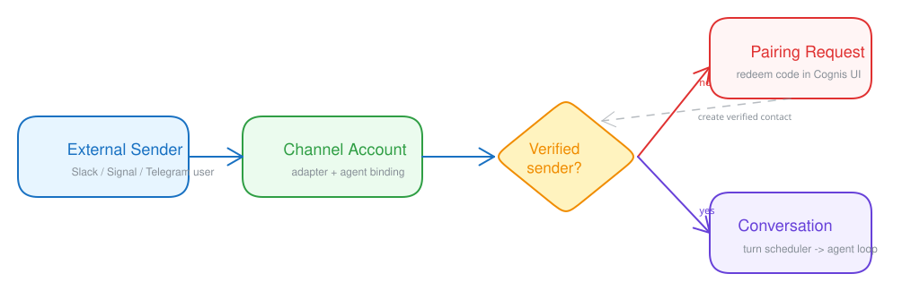

# Channels

Channels connect Cognis agents to external messaging platforms such as Slack, Discord, Telegram, Signal, and similar adapters.

## What a channel account does

A channel account binds:

- one platform connection
- one Cognis agent
- one adapter placement mode
- the credentials and settings needed for that platform

This lets a user talk to a Cognis agent through an external service while keeping the same conversation, session, and safety model.

## Creating a channel account

Open `Channels` and choose an adapter type. Cognis shows:

- a short platform description
- manual setup guidance
- credential fields
- adapter settings
- whether a public webhook URL is required

After the account is saved, Cognis uses the configured adapter to receive and send messages for that platform.

The page also keeps the platform-specific manual setup steps next to the form so you can finish vendor-side configuration while filling in the Cognis settings.

## Controller vs executor placement

Each channel account can run on:

- `Controller` for webhook-based or cloud-hosted integrations
- `Executor` for adapters that need user-local services or network reachability

Use executor placement when the integration depends on something that should stay near the user, such as a local helper service.

## Pairing and trust

Channel accounts can require sender verification before unknown remote users are allowed to interact with an agent.

This pairing flow helps prevent an unverified external sender from immediately gaining access to a user-owned agent. The UI stores verified mappings between external contacts and Cognis users.

In practice, the pairing tab becomes your operational view for pending verifications, while the contacts tab shows which remote senders have already been trusted.

## Platform-specific setup

Different adapters have different requirements. Examples include:

- bot tokens
- webhook verification secrets
- service account credentials
- local API URLs for helper services

The `Channels` page includes platform-specific manual setup steps next to the form so operators can complete the vendor-side configuration without leaving the app flow.

## Operational notes

- One bot or channel identity should map to one agent unless the platform explicitly supports a different pattern.
- Webhook-based platforms need a reachable public URL.
- Executor-hosted adapters depend on the selected executor being connected and healthy.
