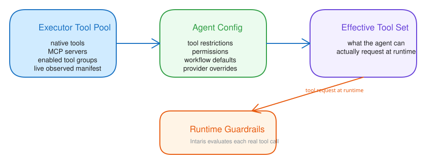

# Creating Agents

Open `Agents` to create or edit agents. An agent defines how Cognis should behave, what tools it can use, which model it prefers, and which workflows it may run.

## Key sections

### Identity

- agent ID
- name / display name
- description
- avatar URL

These fields make the agent recognizable in the UI and help you distinguish between general-purpose, specialist, and background agents.

### Personality

- tone
- temperament
- purpose
- behavioral rules
- system prompt

The runtime identity is composed in two layers:

- `tone`, `temperament`, `purpose`, and `behavioral rules` form the core identity
- `system prompt` adds free-form instructions on top of that core

The editor shows a **System prompt preview** so you can see the exact combined
system message the LLM will receive.

If you use **Sync personality**, Cognis re-bootstraps the structured
personality fields to Mnemory as the evolution seed. This can override evolved
identity in Mnemory, so the UI asks for confirmation first.

For a first agent, keep personality instructions short and practical. Add more constraints only when you know the agent needs them.

### Tools and permissions

- executor binding (specific executor or label selector)
- additional executors (optional, agent-only routable — see below)
- inherited tool categories from the selected executor
- explicit tool groups plus granular `allow_tools` / `deny_tools`
- legacy category and per-tool disable switches
- per-tool permission policy (`allow`, `evaluate`, `deny`)
- assigned knowledgebases
- allowed secrets
- delegation permission
- max delegation depth

Agents combine curated tool assignment with runtime availability. The effective
tool set is:

1. default/static tools available to the agent runtime
2. plus tools from explicit `tool_groups`
3. plus individual `allow_tools`
4. minus individual `deny_tools` and legacy disabled categories/tools
5. then filtered by executor/MCP/runtime availability
6. with `tool_permissions` applied separately for guardrails behavior

If you leave the executor empty, Cognis resolves it from the agent's label
selector or the system default executor.

Knowledgebase assignment is separate from tool assignment: `allowed_knowledgebases`
controls which KBs the agent can access, while knowledgebase tools control what
the agent can do with those KBs.

Use `manage_agents` tool CRUD actions (`tools_list_available`, `tools_get`,
`tools_validate`, `tools_set/add/remove`, and `knowledgebases_*`) rather than
guessing tool IDs or editing raw blobs.

### Additional executors (Stage 36)

The agent editor lets you attach additional executors next to the primary
executor binding. Each entry is either a specific executor or a label
selector, plus an optional description.

Additional executors are not auto-selected. The agent reaches them in two ways:

- `target_executor=<id>` on a single tool call — runs that one call on
  the named executor without changing the conversation's active binding.
- `switch_executor` tool (or the `/executor <id>` slash command) — moves
  the conversation's active routing slot to that executor for all
  subsequent tool calls until the next switch.

When the active executor is in the additional set, every LLM turn shows
a hidden reminder so the agent stays aware that it is on a non-primary
host. The controller never auto-changes the binding; the agent (or user)
is the only mutator.

### MCP servers

Global MCP servers are managed from **Settings → Tools**, then assigned to
executors from **Settings → Executors**. Agents do not own MCP server process
config anymore — they inherit MCP tools from the executor they run on.

The agent editor can also allow **Intaris MCP servers** directly for that agent. Use that path when the remote MCP capability is managed by Intaris rather than attached to the executor tool pool.

Legacy inline MCP entries may still appear on older agents with:

- name
- command
- arguments
- environment variables
- timeout

Use **Settings → Tools** to create, edit, and test configured MCP servers.
Use **Settings → Executors** to attach those MCP servers to a specific
executor. Agent-side tool toggles then control whether the agent can use the
MCP tool categories provided by that executor.

### LLM configuration

- provider selection
- model override
- temperature
- max tokens

Use overrides only when the agent really needs different behavior from the default routing policy.

### Workflow settings

- available workflows
- default workflow
- selection mode
- step agent overrides

Workflow settings matter most when the agent should do structured background work instead of only direct chat responses.

## Practical create flow

In the create form, the most useful order is:

1. identity and display fields
2. personality and behavior guidance
3. executor and tool restrictions
4. provider/model overrides only if necessary
5. workflow defaults for structured execution

Most agents should inherit as much as possible from system defaults and only override what truly makes them different.
