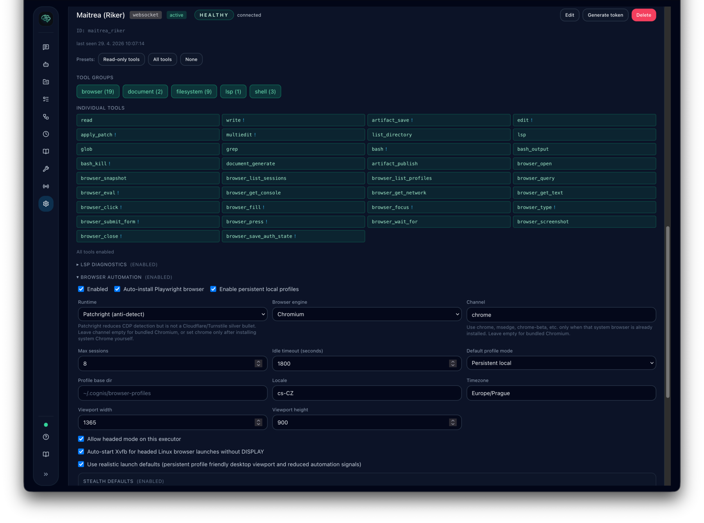

# Executors

Executors are the part of Cognis that perform tool execution. The controller decides what should happen; executors are the hands that actually run tools.




## Why executors exist

This separation lets Cognis:

- keep orchestration logic in one place
- isolate tool execution
- connect to remote machines when tools need local access
- optionally route model inference through a matching executor

## Executor modes

Depending on configuration, Cognis can use:

- in-process executors for simple local setups
- subprocess executors for local isolation
- remote WebSocket executors for user-local or multi-machine deployments

For multi-user production setups, remote executors are the preferred model.

## What executors control

Executors define the effective tool pool available to agents. Agents inherit tools from their executor and can then further limit categories, individual tools, and permission policy.

Executors can also be used to:

- attach MCP servers
- expose only selected tool groups
- run LSP diagnostics for filesystem edit tools
- host Playwright-backed browser automation
- host channel adapters that need local services
- route provider calls to executor-side inference when supported

## Where to manage executors

Open `Settings` and use the executors section to inspect:

- configured executors
- status and health
- desired vs applied config generation
- enabled tool groups
- individually enabled tools
- attached MCP servers

If browser automation is enabled on an executor, the same settings area also
lets you configure browser runtime behavior such as auto-install, engine,
headed-mode allowance, persistent local profiles, Xvfb fallback for headed
Linux launches, session limits, and idle timeout.

### Runtime states

WebSocket executors can report several runtime states:

- `active` - the current desired generation is fully applied
- `degraded` - the current desired generation is applied, but one or more assigned MCP servers failed and were omitted from the active tool set
- `reconfiguring` - Cognis is pushing a newer desired generation to the connected executor
- `stale` - a newer desired generation is stored in Cognis, but the executor has not applied it yet
- `blocked` - the executor is connected, but the last configure attempt failed in a non-recoverable way
- `offline` - no executor WebSocket connection is currently active

`desired` and `applied` are config generations, not simple reconnect counters. If they differ, the executor is behind the latest saved configuration.

## Choosing the right mode

- Use local executor modes for development and simple single-user setups.
- Use remote WebSocket executors when tools, channels, or model endpoints must stay on another machine.
- Disable local executor modes in shared production environments if the controller should not execute tools locally.

## Common troubleshooting checks

- verify the executor is connected
- if `desired != applied`, wait for reconfigure or reconnect the executor
- confirm the required tools are enabled on the executor
- confirm the agent is bound to the expected executor or label selector
- confirm any required secrets or MCP servers are assigned correctly
- confirm browser automation is enabled if browser tools are expected

## LSP diagnostics

LSP diagnostics are executor-local, just like filesystem tools. Cognis now uses
the same LSP flow on all executor types:

- `in_process`
- `subprocess`
- `websocket`

`read` still warms matching language servers in the background. `write`,
`edit`, `patch`, and `multiedit` wait briefly for first-use diagnostics when
LSP is enabled, but diagnostics remain best-effort: the file operation still
succeeds if server startup or diagnostics collection times out.

The filesystem `patch` tool now accepts strict `apply_patch` syntax as well as
the supported unified diff update subset. Existing-file patch updates, deletes,
and moves still require a prior `read`; `Add File` does not.

Use `/lsp` in chat to inspect the current LSP state for the active user's
executors. The command reports normalized executor-local status:

- `ready` - LSP status was collected successfully
- `disabled` - executor config has LSP disabled
- `unsupported` - the connected executor is older and does not expose LSP status
- `unavailable` - executor is disconnected or status collection timed out

`/lsp` is read-only. It does not auto-install language servers or trigger any
network fetches.

## Browser automation

Browser automation is executor-native. The controller handles orchestration,
credentials, approvals, and retry policy, but the executor is the only
component that launches Playwright and performs page actions.

In `Settings -> Executors`, the browser section stores executor config like:

```json
{
  "browser": {
    "enabled": true,
    "auto_install": true,
    "headed_allowed": true,
    "persistent_profiles_enabled": true,
    "profile_mode_default": "persistent_local",
    "realistic_launch": true,
    "xvfb_auto": true,
    "engine": "chromium",
    "runtime": "playwright",
    "channel": null,
    "max_sessions": 8,
    "idle_timeout_seconds": 1800,
    "navigation_timeout_seconds": 60,
    "wait_until": "domcontentloaded",
    "network_idle_after_dom_seconds": 3,
    "stealth_enabled": true,
    "realistic_user_agent": true,
    "default_timezone_id": "UTC",
    "default_accept_language": "en-US,en;q=0.9"
  }
}
```

The default human-like setup for a sticky local executor is now:

- `profile_mode_default = "persistent_local"`
- `persistent_profiles_enabled = true`
- `realistic_launch = true`
- `stealth_enabled = true` (applies `playwright-stealth` evasions to every new context)
- `xvfb_auto = true` for headed Linux executors without a real display

This keeps cookies, local storage, and other profile state in a local
Playwright user data directory on that executor. It is best for sites that are
hostile to clean ephemeral contexts, but it is explicitly executor-local.

Browser fetches use short-lived ephemeral sessions and separate web settings:
`web.browser_fetch.session_idle_seconds`, `navigation_timeout_seconds`,
`wait_until`, and `network_idle_after_dom_seconds`. The default fetch navigation
waits for `domcontentloaded`, then does a short best-effort `networkidle` wait so
slow ad/analytics requests do not block extraction indefinitely. Explicit
`browser_open` sessions use the executor browser idle timeout, which defaults to
30 minutes.

### Stealth defaults

By default Cognis applies `playwright-stealth` evasions to every new browser
context (override per-evasion via the *Disable specific evasions* field in the
UI, or disable globally with `stealth_enabled = false`). When stealth is on the
context also gets:

- a current Chrome desktop `User-Agent` (turn off with `realistic_user_agent =
  false`)
- `Accept-Language: en-US,en;q=0.9` (override via `default_accept_language`)
- `timezone_id = "UTC"` when no `timezone_id` is configured (override via
  `default_timezone_id`)

Honest disclaimer: stealth helps against the JavaScript-detection layer
(`navigator.webdriver`, plugin/codec lists, WebGL vendor, canvas, etc.) but
does **not** fix TLS/JA3 fingerprinting and is not a Cloudflare managed
challenge or Turnstile silver bullet. For hard sites, headed mode + Xvfb +
persistent profile + `channel = "chrome"` remains the most reliable setup.

### Behaviour layer (autoconsent, humanizer, fingerprint hardening)

Three additional behaviour-layer enhancements ship on top of stealth and are
runtime-agnostic — they apply to both `runtime = "playwright"` and
`runtime = "patchright"` without any extra configuration. All three default
ON when stealth is enabled and OFF when it is disabled, with per-executor
overrides.

**Cookie-consent auto-dismiss** (`auto_consent`). Cognis ships a curated
CMP-killer that auto-clicks the configured action on common cookie banners
(OneTrust, Cookiebot, Quantcast, Sourcepoint, Didomi, TrustArc, Iubenda,
Usercentrics, CookieYes, Borlabs, Osano, Klaro, Termly, Moove GDPR,
Complianz, CookieLawInfo) plus a heuristic fallback for unknown banners.
Defaults to `"accept"` (faster page render). Switch to `"reject"` for
privacy-first, or `"off"` to disable. Per-host opt-out via
`auto_consent_disabled_domains`. The script bundle is vendored at
`cognis/tools/executor/browser/assets/autoconsent.bundle.js`; bump
`cognis/tools/executor/browser/assets/VERSION.txt` and edit the JS file in
place when adding new selector rules.

**Input humanizer** (`humanize_input`, `humanize_intensity`). `browser_click`,
`browser_fill`, and `browser_type` move the mouse along Bezier paths and
emit per-key delays sampled from a normal distribution, defeating naive
trajectory-based bot detection. Default intensity is `"low"` (~150 ms
overhead). Each call may override with an `intensity` argument: `off`, `low`,
`medium`, `high`. Set `humanize_input = false` on the executor to fall back
to the legacy direct `click()`/`fill()`/`type()` semantics.

**Fingerprint hardening** (`fingerprint_hardening`). Three small init
scripts:

- `audio_context`: adds tiny per-profile-deterministic noise to
  `AudioBuffer.getChannelData()` so audio fingerprint probes see a stable
  but non-baseline value
- `battery_api`: stubs `navigator.getBattery()` with a per-profile-stable
  plausible value (defeats the headless-Chrome flat-baseline tell)
- `viewport_jitter`: ±2% jitter on `window.innerWidth/innerHeight` for
  ephemeral sessions only (skipped on persistent profiles to preserve
  identity stability)

The seed is derived from the persistent profile id (or the runtime
generation for ephemeral sessions) so re-visits to the same site see a
consistent fingerprint. Disable individual scripts by adding
`audio_context`, `battery_api`, or `viewport_jitter` to the
*Disable specific evasions* field.

### Browser runtimes (Playwright vs Patchright)

Cognis ships two browser runtimes side by side. Pick one per executor:

| Runtime | When to use | Notes |
| --- | --- | --- |
| `playwright` (default) | Most sites. Combined with stealth, handles low- and mid-tier WAFs. | Bundled Chromium just works; set `channel = "chrome"` to use installed Chrome stable. |
| `patchright` | Sites that detect CDP `Runtime.enable` (Cloudflare bot fight, Datadome lite, Brotector). | Set `channel = "chrome"` (auto-set when you pick `patchright`). Stealth defaults to *off* because Patchright already covers the same evasions. |

Patchright is most effective with `runtime = "patchright"` + `channel =
"chrome"` + `profile_mode_default = "persistent_local"` + headed mode (with
`xvfb_auto = true` on Linux executors without a real display). It is **not** a
silver bullet for headless Cloudflare; the same operational disclaimer above
applies.

The default executor image bundles **Chromium** (Playwright build) and
**Chrome stable**. Firefox and WebKit are *not* pre-installed in the default
image; they auto-install on first use, or rebuild the image with:

```
docker build --build-arg COGNIS_EXECUTOR_BROWSERS="chromium chrome firefox webkit" -f Dockerfile.executor .
```

To pre-warm browsers on a fresh host without waiting for the first session,
run:

```
cognis-executor browser-install --all-defaults
# or, equivalently:
cognis-controller executor browser-install --all-defaults
```

This pre-installs Playwright's Chromium, Playwright's Chrome stable, and
Patchright's Chrome stable so first-session latency is instant. Add
`--runtime patchright --channel chrome` for a single combination.

Saved browser auth state can still be stored in Cognis as an encrypted
credential record. Use that when you need controller-owned, portable auth state
instead of sticky local browser identity.

### How agents should use profile mode

`browser_open` now supports:

- `profile_mode = "default"`
- `profile_mode = "ephemeral"`
- `profile_mode = "persistent_local"`

Recommended agent behavior:

- use `default` for most browser opens
- use `ephemeral` only when a fresh clean session is specifically needed
- use `persistent_local` for sticky local browser identity or when a site blocks fresh contexts
- call `browser_list_sessions` first when you want to resume an already-open browser session
- call `browser_list_profiles` when you want to reuse a persistent local profile but no live session is active

`profile_id` is optional when `persistent_local` is used. If omitted, Cognis
derives a stable site-scoped local profile automatically from the target URL.

### Session and profile lifecycle

Live browser sessions and persistent local profiles are different things:

- a **browser session** is the active Playwright context/page currently running on the executor
- a **persistent local profile** is the executor-local user data directory reused across sessions

Cognis now exposes both through browser tools:

- `browser_list_sessions` lists currently active sessions so the agent can resume one instead of opening a duplicate
- `browser_list_profiles` lists persistent local profiles available on that executor
- `browser_query` inspects matching page elements with rich metadata for debugging and exact targeting
- `browser_eval` runs arbitrary JSON-returning page-context JavaScript as a privileged debug/control tool
- `browser_get_console` and `browser_get_network` expose recent runtime diagnostics for the active browser session

Idle browser sessions are automatically closed after the executor's
`idle_timeout_seconds`, but persistent local profile directories remain on disk
for later reuse. `browser_list_sessions` shows only non-expired live sessions;
expired sessions are hidden and cleaned up by subsequent browser operations.

For difficult auth or MFA flows, prefer the low-level inspection/debug path:

1. `browser_snapshot` or `browser_query` to inspect actionable candidates
2. `browser_focus` and `browser_type` when real key events are more reliable than `browser_fill`
3. `browser_get_console` / `browser_get_network` to diagnose silent submit failures
4. `browser_submit_form` when clicking a button is not enough

### Headed Linux browsers and Xvfb

On Linux executors, a headed browser without a real `DISPLAY` needs a virtual
X server. When `xvfb_auto = true`, Cognis starts `Xvfb` automatically for
headed launches that need it.

`Xvfb` must already be installed on the executor host. Cognis does not install
OS packages for you.

## MCP stdio command format

For executor-hosted stdio MCP servers, `Command` is the executable only. Cognis does not run a shell.

Use:

- `Command`: `npx`
- `Arguments`:

```text
-y
@doist/todoist-ai
```

Do not paste the full shell command into `Command`. Values like `npx -y @doist/todoist-ai` are treated as a single executable path and will fail.

If an assigned MCP server fails or times out during `spawn`, `initialize`, or `tools/list`, Cognis keeps the executor connected and marks it as `degraded`. The failing MCP server is omitted from the active observed tool set until the configuration is fixed and reapplied.

## Running as a systemd service

Cognis ships with systemd unit templates in [`deploy/systemd/`](../../deploy/systemd/) for running the controller and executors as managed services on Linux.

### Environment variables

The executor CLI reads connection parameters from environment variables so that tokens never appear in `/proc/<pid>/cmdline`:

| Variable | Description |
|---|---|
| `COGNIS_CONTROLLER_URL` | WebSocket URL of the controller |
| `COGNIS_EXECUTOR_TOKEN` | JWT authentication token |
| `COGNIS_EXECUTOR_WORKDIR` | Default working directory for executor tool calls. Defaults to the executor user's home directory. |

CLI flags (`--controller-url`, `--token`, `--workdir`) still work and take precedence over environment variables.

When installed from PyPI, the recommended command is `uvx cognis-executor`.

### System-level executor (template unit)

The template unit `cognis-executor@.service` runs one executor per dedicated Unix user. The instance name (`%i`) is the user and group.

```bash
# Install the template
sudo cp deploy/systemd/cognis-executor@.service /etc/systemd/system/
sudo systemctl daemon-reload

# Create env file for user "alice"
sudo tee /etc/cognis/executor-alice.env <<'EOF'
COGNIS_CONTROLLER_URL=wss://cognis.example.com/api/executor/ws
COGNIS_EXECUTOR_TOKEN=eyJ...
COGNIS_EXECUTOR_WORKDIR=/home/alice
EOF
sudo chmod 600 /etc/cognis/executor-alice.env
sudo chown alice:alice /etc/cognis/executor-alice.env

# Start
sudo systemctl enable --now cognis-executor@alice
```

Generate the token in **Settings > Executors > Generate token**. Executor tokens do not expire; generating a new token revokes older tokens for that executor.

### User-level executor (no root)

The user unit `cognis-executor.user.service` runs under your own systemd instance. No root access required.

```bash
mkdir -p ~/.config/systemd/user
cp deploy/systemd/cognis-executor.user.service \
   ~/.config/systemd/user/cognis-executor.service
systemctl --user daemon-reload

# Create env file
cat > ~/.cognis/executor.env <<'EOF'
COGNIS_CONTROLLER_URL=wss://cognis.example.com/api/executor/ws
COGNIS_EXECUTOR_TOKEN=eyJ...
COGNIS_EXECUTOR_WORKDIR=/home/your-user
EOF
chmod 600 ~/.cognis/executor.env

# Start
systemctl --user enable --now cognis-executor

# Keep running after logout
loginctl enable-linger $USER
```

### Controller

A system-level controller unit (`cognis-controller.service`) is also provided. See [`deploy/systemd/README.md`](../../deploy/systemd/README.md) for full setup instructions.

### Running from a git checkout

The default `ExecStart` uses `uvx cognis-executor` (PyPI). To run from a local git checkout, swap to `uv run cognis-executor` with a `WorkingDirectory` for uv project resolution. The executor process still switches to `COGNIS_EXECUTOR_WORKDIR` or the service user's home directory before it accepts tool calls.

## Running as a Docker container

The published executor image is `ghcr.io/fpytloun/cognis-executor`. It includes the Python executor runtime, Playwright browsers, `Xvfb`, shell tools, search tools, Node/npm, common language servers, Python formatting tools, Go/Rust/C/C++ build tooling, and a persistent non-root home directory.

Create a WebSocket executor in `Settings -> Executors` and generate a token before starting the container.

For a local controller without TLS, run the executor on the host network so `ws://localhost` is genuinely local to the executor process:

```bash
docker run -d \
  --name cognis-executor \
  --network host \
  -v cognis-executor-home:/home/cognis \
  -e COGNIS_CONTROLLER_URL=ws://localhost:8080/api/executor/ws \
  -e COGNIS_EXECUTOR_TOKEN=eyJ... \
  ghcr.io/fpytloun/cognis-executor:latest
```

For production or any non-local controller, use `wss://`:

```bash
docker run -d \
  --name cognis-executor \
  -v cognis-executor-home:/home/cognis \
  -e COGNIS_CONTROLLER_URL=wss://cognis.example.com/api/executor/ws \
  -e COGNIS_EXECUTOR_TOKEN=eyJ... \
  ghcr.io/fpytloun/cognis-executor:latest
```

The image starts through `tini`, so Kubernetes and Docker `SIGTERM` shutdowns are forwarded correctly and orphaned browser, LSP, MCP, and shell subprocesses are reaped.

### Persistent home directory

Mount `/home/cognis` as a volume when you want browser profiles, LSP caches, shell history, and workspace files to survive restarts:

```bash
docker volume create cognis-executor-home
```

The entrypoint initializes `.bashrc`, `.profile`, `.cognis/cache`, `.cache`, `.local/bin`, and `workspace` when the home directory is writable. If the container runs as root, it fixes ownership and drops to the `cognis` user. If Kubernetes sets `runAsUser`, the entrypoint does not attempt to `chown`; the volume must already be writable by that UID or group.

### Kubernetes security context

Use a persistent volume for `/home/cognis` and set a security context that makes it writable by the runtime user:

```yaml
securityContext:
  runAsNonRoot: true
  runAsUser: 1000
  runAsGroup: 1000
  fsGroup: 1000
  fsGroupChangePolicy: OnRootMismatch
```

For platforms that assign an arbitrary UID, keep `fsGroup` on a writable volume. The image includes `libnss-wrapper` so tools that need a passwd entry still work when the numeric UID is not present in `/etc/passwd`.

Minimal Kubernetes container example:

```yaml
containers:
  - name: executor
    image: ghcr.io/fpytloun/cognis-executor:latest
    env:
      - name: COGNIS_CONTROLLER_URL
        value: wss://cognis.example.com/api/executor/ws
      - name: COGNIS_EXECUTOR_TOKEN
        valueFrom:
          secretKeyRef:
            name: cognis-executor-token
            key: token
    volumeMounts:
      - name: home
        mountPath: /home/cognis
volumes:
  - name: home
    persistentVolumeClaim:
      claimName: cognis-executor-home
```

## Signal on executors

Signal direct mode is an example of why executor-hosted adapters exist.

When a Signal account uses `transport=direct_jsonrpc`, Cognis does not talk to an external REST bridge. Instead, the selected executor starts `signal-cli` directly as a subprocess.

### Minimum executor config for direct Signal

In `Settings -> Executors`, open the executor card and expand `Signal Direct Mode`. Cognis exposes a toggle for direct mode and a field for the `signal-cli` command/path. Under the hood it stores the following executor config:

```json
{
  "signal": {
    "direct_enabled": true,
    "command": "signal-cli"
  }
}
```

Use an absolute path for `command` when `signal-cli` is not on the default `PATH`, for example:

```json
{
  "signal": {
    "direct_enabled": true,
    "command": "/opt/homebrew/bin/signal-cli"
  }
}
```

### Signal executor checklist

Before assigning a Signal direct-mode account to an executor:

1. `signal-cli` is installed on the executor machine.
2. The Signal account is already linked or registered on that machine.
3. The executor is connected in Cognis.
4. The executor config has `signal.direct_enabled=true`.
5. If needed, the executor config points to the correct `signal-cli` binary path.

### Important behavior

- The `signal-cli` command is executor-scoped and therefore user-scoped through executor ownership.
- Channel accounts do not store the executable path.
- Signal account state remains local to the executor machine.
- Moving a direct-mode Signal account to another executor requires migrating the local `signal-cli` state first.
