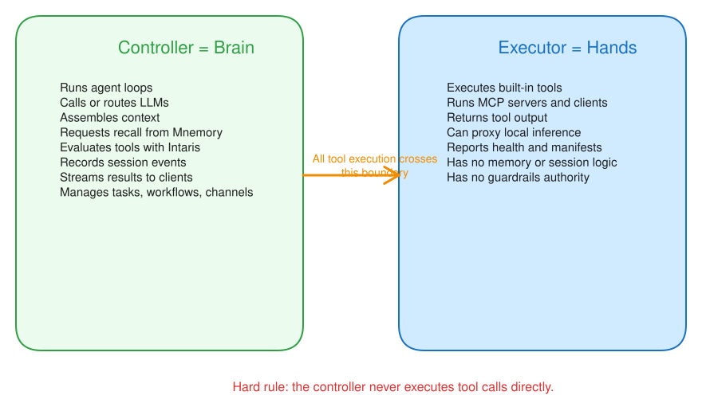

# Executors

Executors are the part of Cognis that perform tool execution. The controller decides what should happen; executors are the hands that actually run tools.



## Why executors exist

This separation lets Cognis:

- keep orchestration logic in one place
- isolate tool execution
- connect to remote machines when tools need local access
- optionally route model inference through a matching executor

## Executor modes

Depending on configuration, Cognis can use:

- in-process executors for simple local setups
- subprocess executors for local isolation
- remote WebSocket executors for user-local or multi-machine deployments

For multi-user production setups, remote executors are the preferred model.

## What executors control

Executors define the effective tool pool available to agents. Agents inherit tools from their executor and can then further limit categories, individual tools, and permission policy.

Executors can also be used to:

- attach MCP servers
- expose only selected tool groups
- host channel adapters that need local services
- route provider calls to executor-side inference when supported

## Where to manage executors

Open `Settings` and use the executors section to inspect:

- configured executors
- status and health
- enabled tool groups
- individually enabled tools
- attached MCP servers

## Choosing the right mode

- Use local executor modes for development and simple single-user setups.
- Use remote WebSocket executors when tools, channels, or model endpoints must stay on another machine.
- Disable local executor modes in shared production environments if the controller should not execute tools locally.

## Common troubleshooting checks

- verify the executor is connected
- confirm the required tools are enabled on the executor
- confirm the agent is bound to the expected executor or label selector
- confirm any required secrets or MCP servers are assigned correctly

## Running as a systemd service

Cognis ships with systemd unit templates in [`deploy/systemd/`](../../deploy/systemd/) for running the controller and executors as managed services on Linux.

### Environment variables

The executor CLI reads connection parameters from environment variables so that tokens never appear in `/proc/<pid>/cmdline`:

| Variable | Description |
|---|---|
| `COGNIS_CONTROLLER_URL` | WebSocket URL of the controller |
| `COGNIS_EXECUTOR_TOKEN` | JWT authentication token |

CLI flags (`--controller-url`, `--token`) still work and take precedence over environment variables.

### System-level executor (template unit)

The template unit `cognis-executor@.service` runs one executor per dedicated Unix user. The instance name (`%i`) is the user and group.

```bash
# Install the template
sudo cp deploy/systemd/cognis-executor@.service /etc/systemd/system/
sudo systemctl daemon-reload

# Create env file for user "alice"
sudo tee /etc/cognis/executor-alice.env <<'EOF'
COGNIS_CONTROLLER_URL=wss://cognis.example.com/api/executor/ws
COGNIS_EXECUTOR_TOKEN=eyJ...
EOF
sudo chmod 600 /etc/cognis/executor-alice.env
sudo chown alice:alice /etc/cognis/executor-alice.env

# Start
sudo systemctl enable --now cognis-executor@alice
```

Generate the token in **Settings > Executors > Generate token**.

### User-level executor (no root)

The user unit `cognis-executor.user.service` runs under your own systemd instance. No root access required.

```bash
mkdir -p ~/.config/systemd/user
cp deploy/systemd/cognis-executor.user.service \
   ~/.config/systemd/user/cognis-executor.service
systemctl --user daemon-reload

# Create env file
cat > ~/.cognis/executor.env <<'EOF'
COGNIS_CONTROLLER_URL=wss://cognis.example.com/api/executor/ws
COGNIS_EXECUTOR_TOKEN=eyJ...
EOF
chmod 600 ~/.cognis/executor.env

# Start
systemctl --user enable --now cognis-executor

# Keep running after logout
loginctl enable-linger $USER
```

### Controller

A system-level controller unit (`cognis-controller.service`) is also provided. See [`deploy/systemd/README.md`](../../deploy/systemd/README.md) for full setup instructions.

### Running from a git checkout

The default `ExecStart` uses `uvx cognis` (PyPI). To run from a local git checkout, swap to `uv run cognis` with a `WorkingDirectory`. Both variants are documented in the unit files as comments.

## Signal on executors

Signal direct mode is an example of why executor-hosted adapters exist.

When a Signal account uses `transport=direct_jsonrpc`, Cognis does not talk to an external REST bridge. Instead, the selected executor starts `signal-cli` directly as a subprocess.

### Minimum executor config for direct Signal

In `Settings -> Executors`, open the executor card and expand `Signal Direct Mode`. Cognis exposes a toggle for direct mode and a field for the `signal-cli` command/path. Under the hood it stores the following executor config:

```json
{
  "signal": {
    "direct_enabled": true,
    "command": "signal-cli"
  }
}
```

Use an absolute path for `command` when `signal-cli` is not on the default `PATH`, for example:

```json
{
  "signal": {
    "direct_enabled": true,
    "command": "/opt/homebrew/bin/signal-cli"
  }
}
```

### Signal executor checklist

Before assigning a Signal direct-mode account to an executor:

1. `signal-cli` is installed on the executor machine.
2. The Signal account is already linked or registered on that machine.
3. The executor is connected in Cognis.
4. The executor config has `signal.direct_enabled=true`.
5. If needed, the executor config points to the correct `signal-cli` binary path.

### Important behavior

- The `signal-cli` command is executor-scoped and therefore user-scoped through executor ownership.
- Channel accounts do not store the executable path.
- Signal account state remains local to the executor machine.
- Moving a direct-mode Signal account to another executor requires migrating the local `signal-cli` state first.
