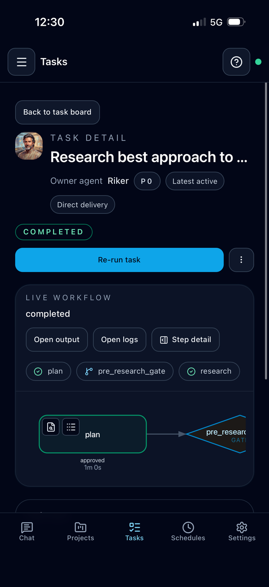

# Managing Tasks

Tasks are how Cognis tracks durable work that should run through a workflow instead of a single immediate chat turn.

## What tasks are for

Use `Tasks` when work should be:

- queued for later execution
- reviewed step by step
- paused for human approval
- routed back into a conversation when complete

The main chat agent can also inspect and manage tasks directly. That includes:

- creating or updating tasks from chat
- inspecting paused task state and step outputs
- resolving workflow gates
- answering paused step questions

## Task board

The task board gives you a kanban-style view of work by status. From there you can:

- create draft tasks
- inspect queued or running work
- open task details
- understand which items are blocked, active, or completed

On mobile the board shows a single column at a time and a segmented-control
selector (Draft / Queued / Running / Paused / Done) so each column fills the
viewport. Drag-and-drop is desktop only; on mobile, open the task detail and
use the state buttons to move work.

## Task detail view

The task detail page shows the full workflow run, including:

- workflow and agent assignment
- current status
- timing and duration
- step runs and attempts
- evaluator feedback
- dependencies
- final result or failure information

This view is the best place to understand why a task is waiting, revising, or failing.

## Gates and step questions

Some workflows pause for human input. When that happens, Cognis records the pause and lets you respond from the task flow instead of losing the context in chat.

You can also steer a paused task from chat through the main agent. When you do that, Cognis keeps the same task/workflow state and carries any operator instruction into the resumed step.

## Delivery model

Task results are delivered back into the target conversation instead of talking directly to external channels. This keeps user-facing communication inside the normal conversation model.

Task follow-ups are not all phrased the same way:

- if the result clearly belongs to the same conversation thread, Cognis can
  integrate it back into that thread
- if the result is scheduled, unrelated, paused, or delivered into another
  conversation, Cognis presents it as a separate notification-style update

If the controller is unsure whether a same-conversation task result still
belongs to the active thread, it falls back to a separate update.

## When to use tasks instead of chat

Prefer tasks when the work needs:

- multiple steps
- explicit review or evaluation
- persistence beyond the current turn
- dependency tracking
- later follow-up in the same conversation

If the same kind of task should run repeatedly, use `Schedules` to create those tasks automatically instead of creating them by hand each time.
