# Rich Deliverable Data Blocks

These screenshots are generated from the deterministic rich-deliverable visual
fixture. They are also a coverage contract: adding a supported block requires
an isolated fixture and a regenerated image.

## Analysis and evidence

### Table
Purpose: present structured rows and columns where exact lookup matters.

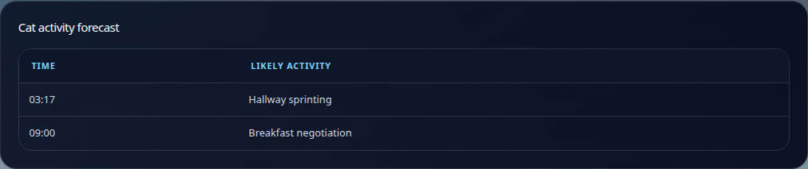

### Comparison matrix and decision matrix
Purpose: compare alternatives or make trade-offs explicit. Include criteria and
avoid presenting an unweighted list as an objective decision.

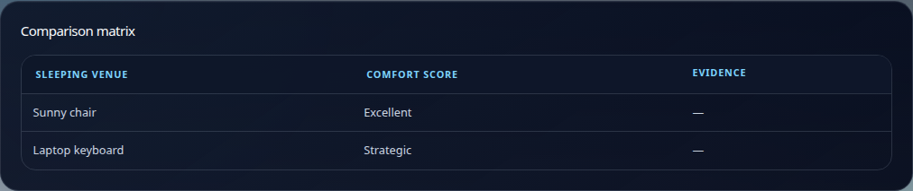
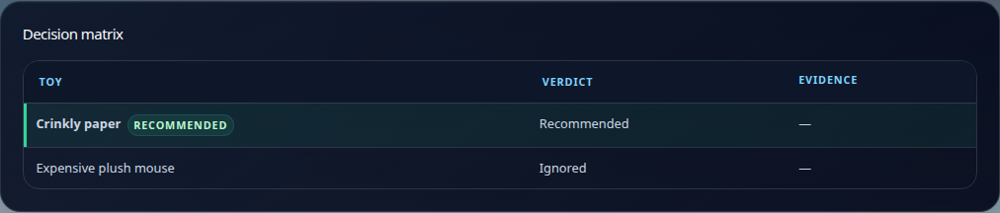

### Research answer, evidence report, and claim cards
Purpose: state evidence-backed conclusions. Connect claims to sources rather
than treating citations as decoration.

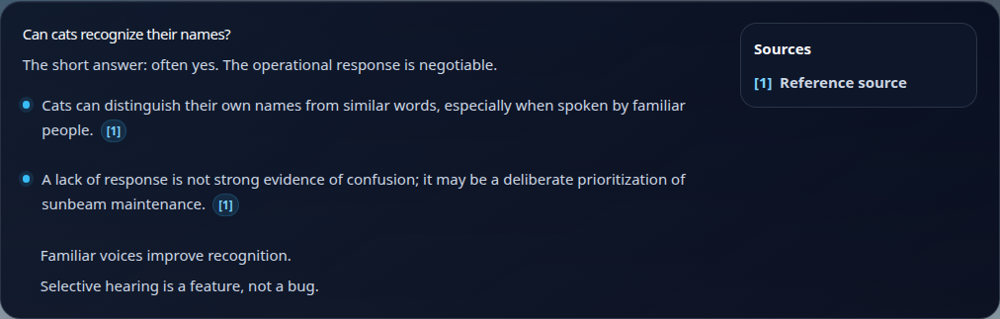
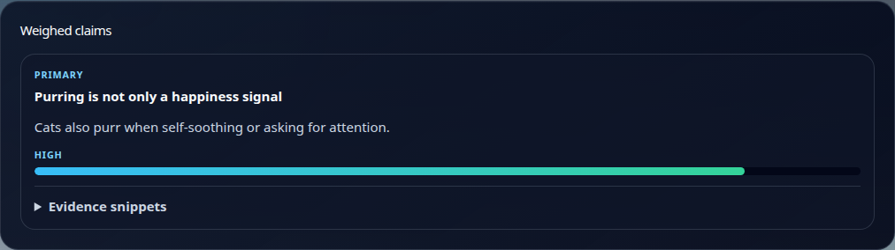
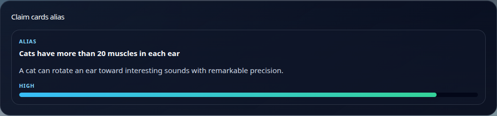

### Chart
Purpose: show a real multi-point quantitative series. Do not use a chart for
one or two categorical facts; use metrics or a table instead.

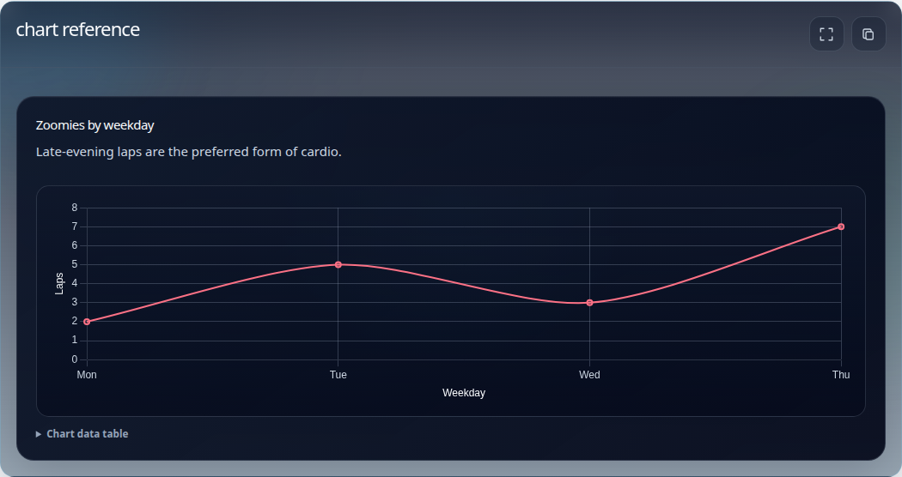

### Bar chart

Use bars to compare a small number of categories.

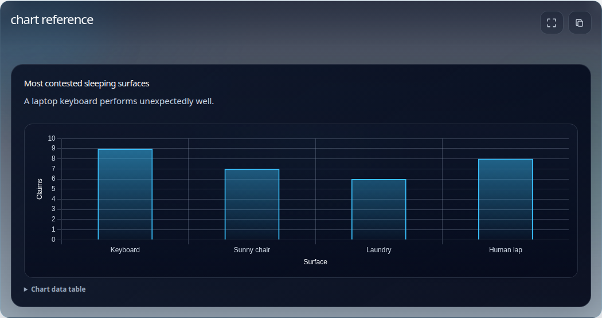

### Donut chart

Use a donut (the supported pie-style chart) for a small, meaningful
composition. Avoid it when exact comparison matters more than share.

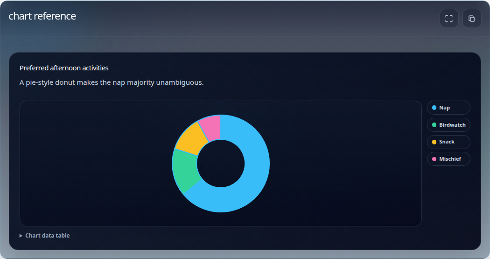

### Stacked bar chart

Use stacked bars to show a total and its components across categories.

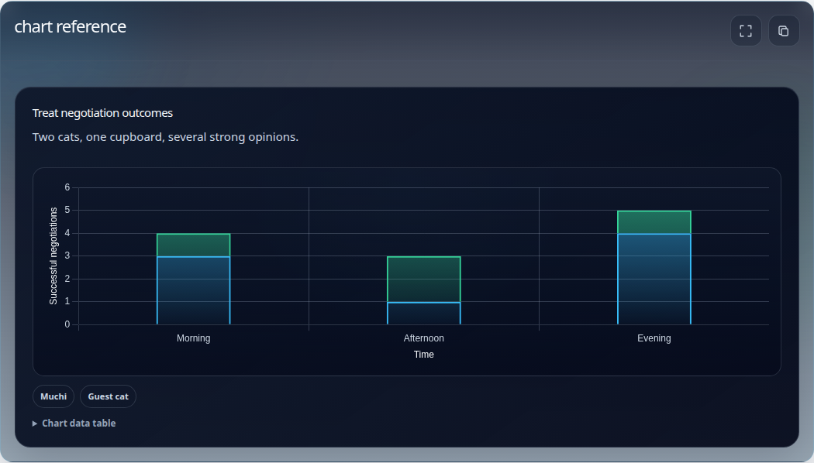

### Source list
Purpose: provide document-level references and provenance.


## Media and technical content

### Figure and gallery
Purpose: show one annotated visual or a related collection of visuals. Provide
useful alternative text and only reference authorized media.


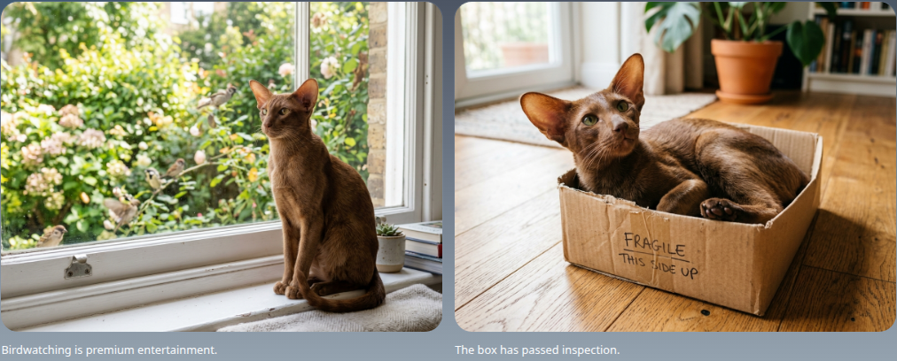

### Code and Mermaid
Purpose: show a literal snippet or a renderer-generated diagram. Keep a
textual explanation in surrounding content for non-visual targets.

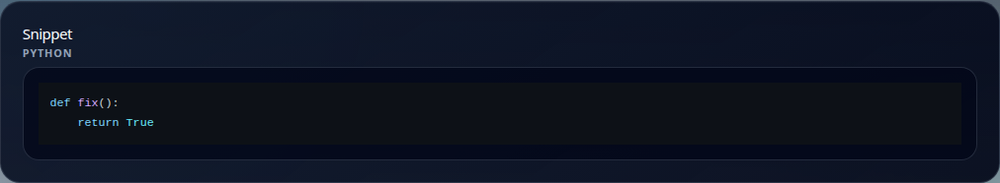
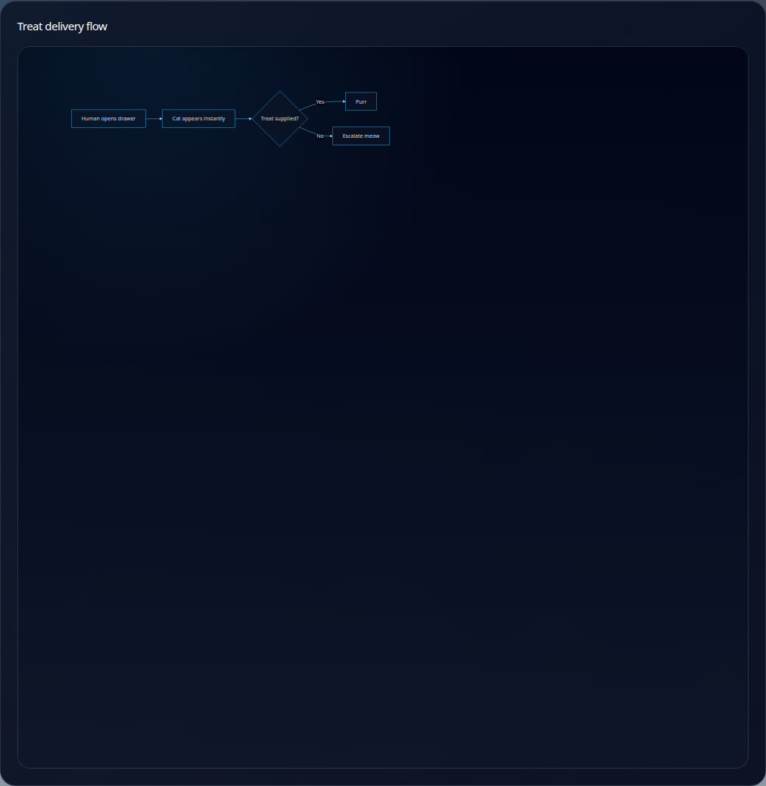

### Link and link preview
Purpose: point readers to an action or external context. Use a preview only
when its metadata helps the reader decide whether to open it.


## Regeneration

Run the focused browser suite to verify coverage:

```bash
cd ui
npx playwright test e2e/rich-deliverable-doc-assets.spec.ts --project=chromium
```

To intentionally update the committed images:

```bash
UPDATE_RICH_DOC_ASSETS=1 npx playwright test e2e/rich-deliverable-doc-assets.spec.ts --project=chromium --update-snapshots
```

Review the PNG diff together with the renderer change. The asset update is
evidence of an intentional visual change, not a replacement for visual review.
