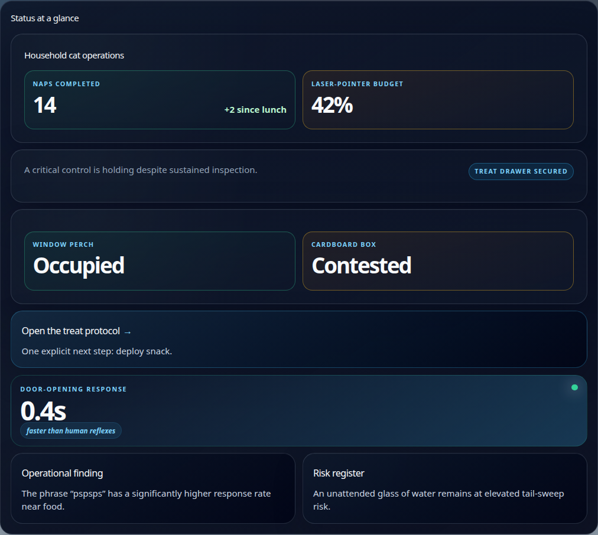
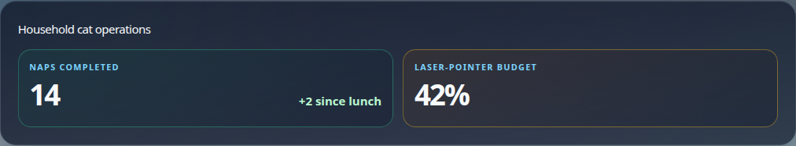
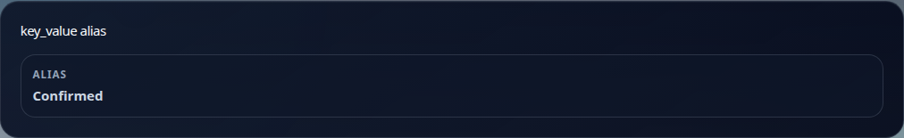

# Rich Deliverable Layout Blocks

These examples are generated from the browser fixture used by visual QA. The
image for each entry is intentionally an isolated rendered block, not a mocked
design illustration.

## Structure and navigation

### Hero
Purpose: establish the document's focal message. Use once, when the reader
needs a clear title and orientation.

### Section
Purpose: introduce a meaningful narrative group. It can contain child blocks.

### Section header

Purpose: divide a dashboard or report with an eyebrow, title, subtitle, and
optional semantic status. Use it for hierarchy, not as a content card.

### Stack, columns, and grid
Purpose: arrange related blocks vertically, side by side, or in a responsive
grid. Use layout blocks to establish hierarchy, not to add decoration.

New `grid` payloads can set `layout` to `"auto"`, `"equal"`,
`"split-2-1"`, or `"split-1-2"`. Narrow component containers stack every
layout in source order. Child blocks can set `span` from 1 through 4 and
`surface` to `"plain"`, `"subtle"`, `"outlined"`, `"raised"`, or `"accent"`.

Grid layouts support `auto`, `equal`, `split-2-1`, and `split-1-2`. Columns
remain limited to one through four. Narrow renderers stack blocks in source
order. Blocks can span one through four grid tracks.

### Metric progress
Metrics can include `progress: { value, max, label? }`. The renderer exposes
the value through an accessible progress bar. Keep `value` and `max` numeric.

### Tabs, accordion, and modal
Purpose: disclose secondary information without making the primary reading path
longer. Keep tab labels and disclosures understandable without their hidden
content.

## Narrative and editorial blocks

### Markdown
Purpose: ordinary prose, headings, lists, and lightweight technical writing.
Prefer it when a specialized visual block would not improve comprehension.

### Callout, quote, and divider
Purpose: emphasize one important caveat, preserve a direct quotation, or
separate major reading sections. Use sparingly.

### Timeline, steps, and day agenda
Purpose: show chronology, an ordered procedure, or a date-scoped plan.

### Incident timeline
Purpose: communicate an incident's factual sequence. Pair it with evidence and
actions rather than using it as a narrative substitute.

## Status and action blocks

### Card and card grid
Purpose: compactly group a small set of related items. Do not nest cards
without a clear hierarchy.

#### Visual editorial card

Use `card` with `variant: "visual"` for one image-led editorial story where
the image carries genuine context: a place, event, product, person, or
decision. The card renders the media full-bleed with a contrast overlay,
eyebrow, title, and short summary. Supply specific media alt text and
provenance. If an appropriate image is unavailable, use `feature` or
`editorial` rather than inventing decorative media.

### Dashboard, status, status grid, and metric
Purpose: provide an at-a-glance operational or decision summary. Metrics should
be meaningful values, not decorative labels.

Use `action: "rich:dashboard"` for a strict dashboard composition. It requires
a title, at least two metric or status blocks, and a table or chart. The action
owns presentation metadata and normalizes the canvas to `wide` and density to
`compact`.
Use metric progress for bounded values. The text label and numeric ratio remain
visible on non-visual surfaces.

### Action, checklist, and incident checklist
Purpose: turn a finding into a concrete next step or track completion. An
incident checklist is intended for operational response.

### Key-value blocks
Purpose: list compact facts. `kv` and `key_value` are supported aliases; use
`key_value` in new payloads.

Continue with [data, evidence, media, and utility blocks](rich-deliverable-blocks-data.md).
