# Product showcase

Cognis is not only a place to chat with agents. It is a workspace for real
work. Agents can research, edit files, run commands, use browsers, coordinate
other sessions, and produce durable results.

The same work remains visible at your desk, at home, or on your phone.

## Work from the dashboard

The dashboard brings tasks, schedules, conversations, and recent results into
one workspace. Window management lets you open several active views without
losing the dashboard context.

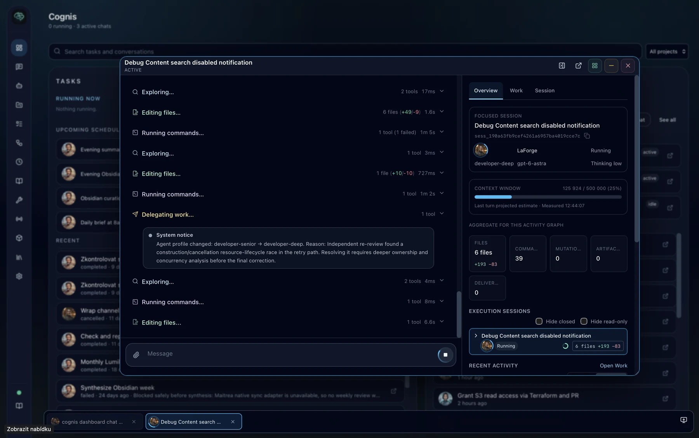

Each managed window keeps its own navigation and activity view. Persistent
window tabs make it easy to switch between conversations and tasks.

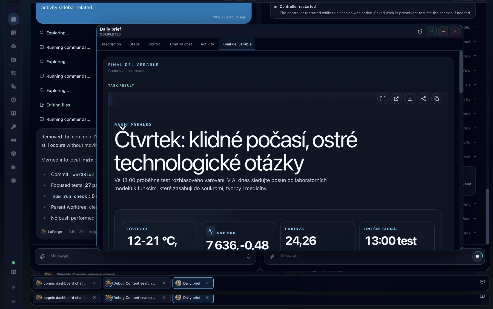

## Inspect real work

The conversation timeline reports exploration, file edits, commands,
delegation, and system notices as they occur. The activity sidebar connects
those events to the complete work graph.

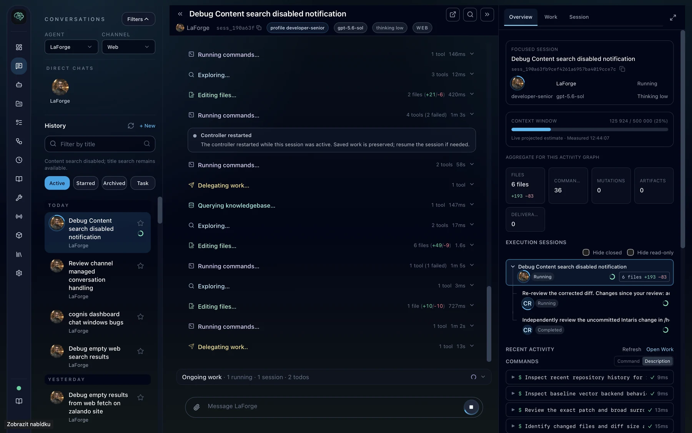

The **Work** view groups files, commands, mutations, artifacts, and
deliverables. Each command keeps its description, status, duration, output,
and evaluation.

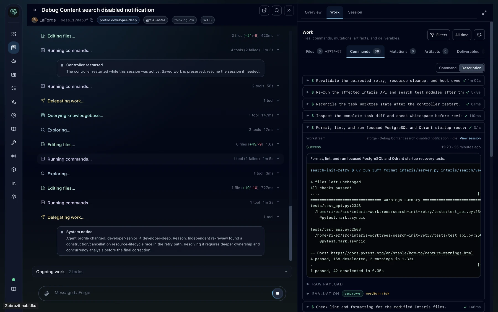

Changed files remain inspectable beside the conversation. You can review the
exact diff without leaving the workspace.

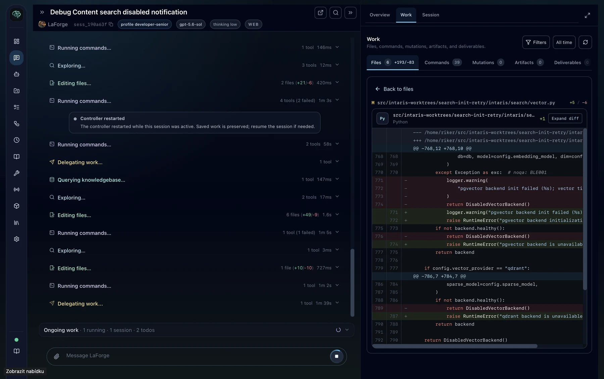

## Continue from mobile

The installable mobile app shows active work directly in conversation history.

  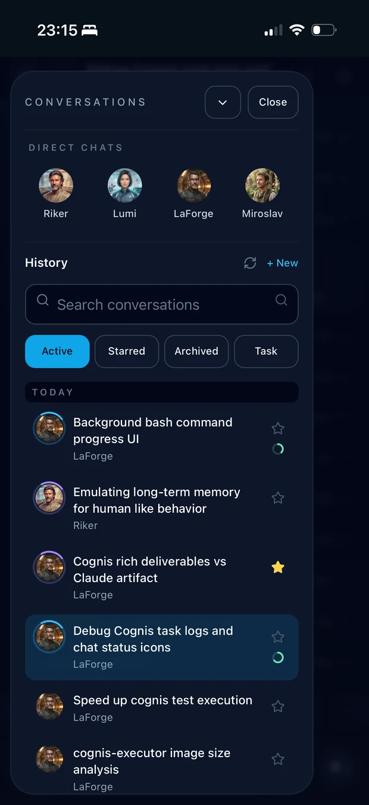
  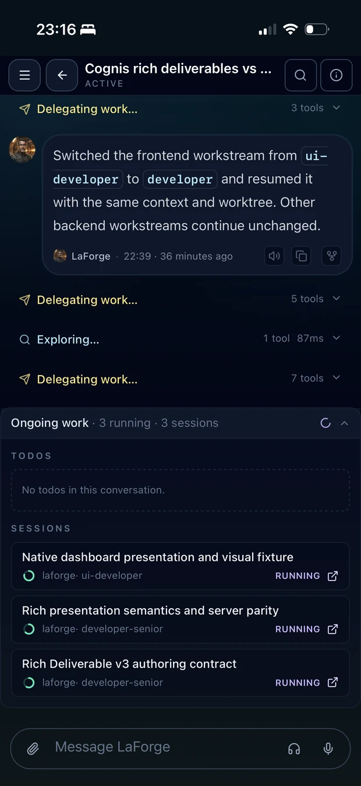

Open the activity overview to see the focused session, context use, changed
files, command count, execution sessions, and recent activity.

  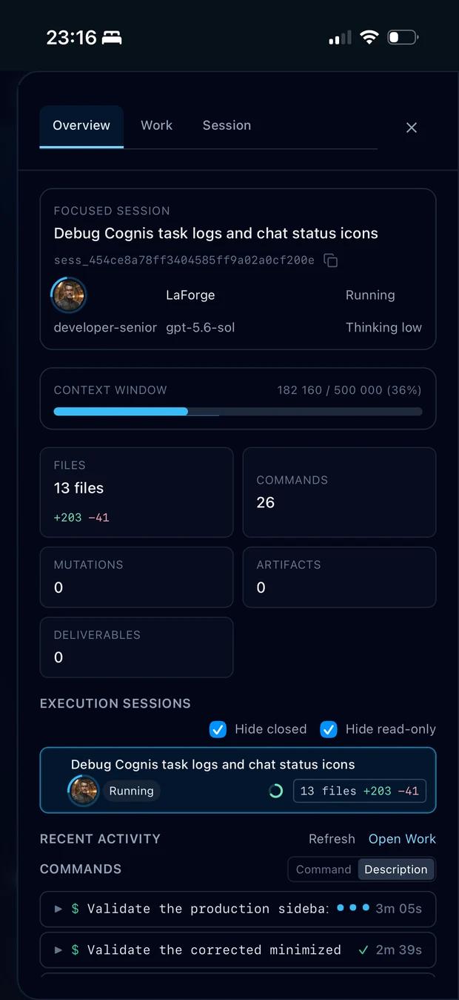
  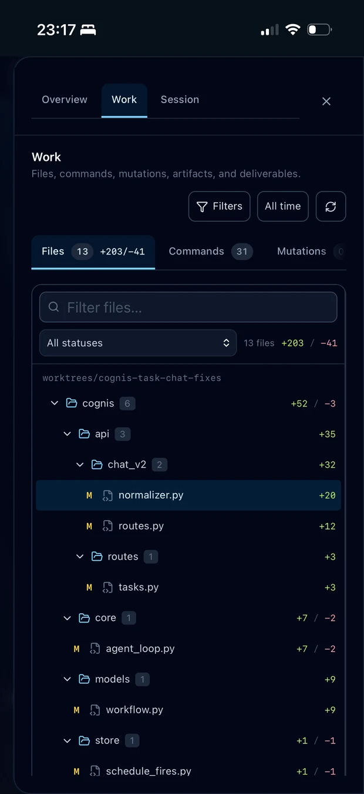

Command output and source diffs use the same work history as the desktop
interface.

  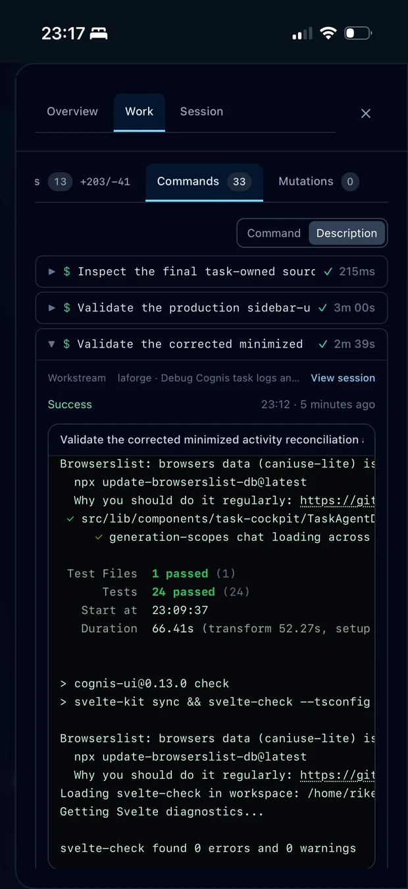
  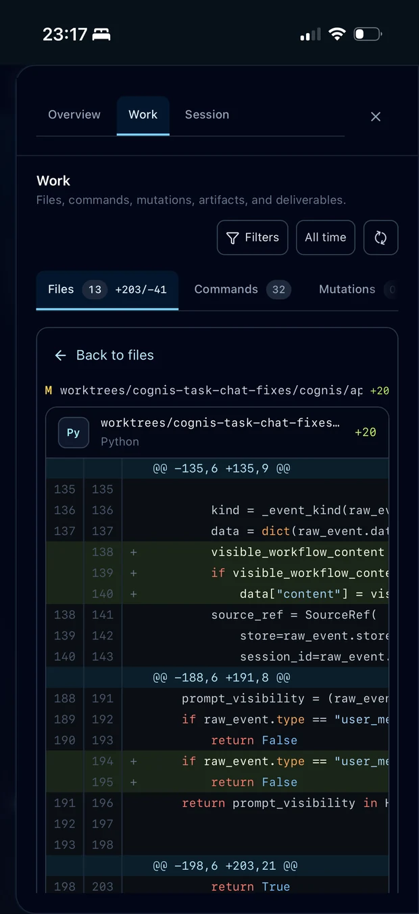

## Configure the workspace

Executors bring tools close to the systems that they operate. Configure
browser automation, shell access, language servers, MCP servers, and skills
for each environment.

  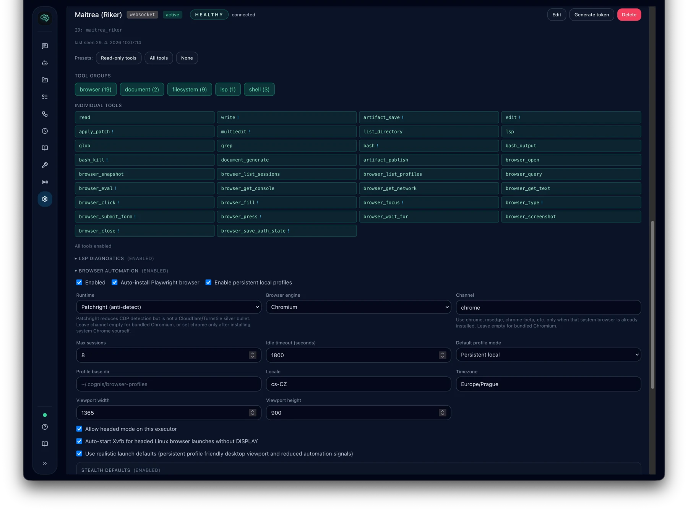
  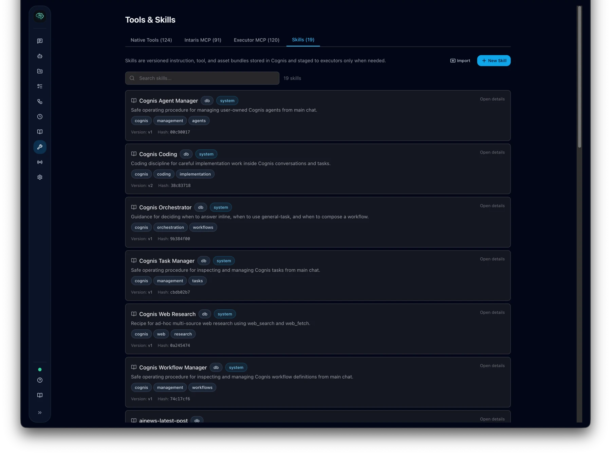

