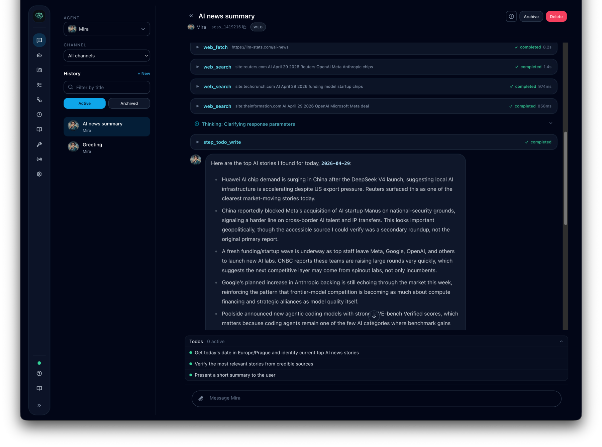
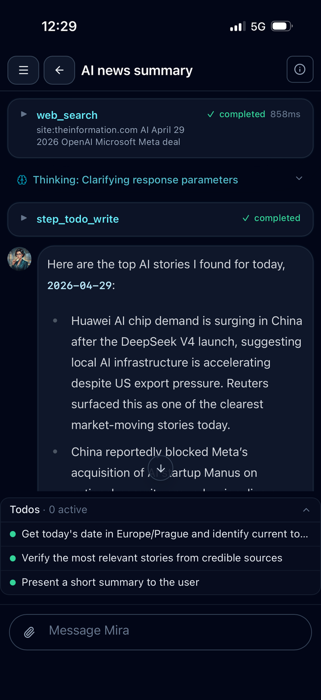

# Using Chat

The chat workspace is where you talk to an agent, watch responses stream in real time, and follow tool usage or delegated work without leaving the conversation.

## Starting a conversation

Open `Chat`, create a new conversation, and select an agent.
Web conversations can exist before they have an active session; Cognis creates the root session when you send the first real message.

That first message is also used to bootstrap Intaris intention generation right away, so the session purpose is available from the first turn instead of waiting for a follow-up turn.

## What the chat UI shows

Depending on what the agent is doing, the conversation can display:

- streaming assistant responses
- reasoning or progress blocks
- tool call indicators and results
- delegation status cards for background work
- queued messages when you send another message during an active turn
- reconnection status for the WebSocket session

## Queued messages

If you send a message while the agent is still processing the previous turn,
Cognis queues the new message instead of interrupting the active turn. The chat
workspace shows each pending queued message before it runs.

Queued messages are compact by default so a long follow-up cannot take over the
chat viewport while the active turn is still running. Each queued row shows a
single-line preview, status, and the main controls; open the details view when
you need to review the full text.

From the queued-message panel you can:

- expand a queued row to review the exact message text waiting to run
- edit the queued text before Cognis starts processing it
- delete a queued message to cancel it

Queued attachment changes are handled by deleting the queued message and sending
a replacement, because attachments are already uploaded and referenced by the
time a message enters the queue. If you keep a queued message with attachments,
Cognis preserves the prepared attachment context and uses it when the queued
turn runs later.

## Approvals and escalations

If Intaris escalates a tool call, the chat UI shows an approval prompt. From there you can approve or deny the requested action.

This is how Cognis keeps risky or sensitive actions visible to the user instead of silently executing them.

## Markdown, links, and tool output

Assistant responses render Markdown as they stream. Plain `http://` and
`https://` URLs are clickable even when the agent did not format them as
Markdown links. URLs inside inline code or fenced code blocks stay as literal
text.

Tool results preserve raw output for copying. Filesystem `read` results use
syntax highlighting when Cognis can infer a language from the file path, while
JSON-shaped outputs keep the dedicated JSON rendering.

## Delegation and background work

Some work is better handled through delegated or structured execution instead of one immediate chat turn. When that happens, Cognis can show:

- a delegation card
- intermediate progress
- final completion or failure updates

The main conversation stays responsive while the sub-session or workflow continues.
Completed delegated work keeps its recoverable output with the sub-session. If a
sub-session produced several assistant messages, Cognis keeps them in order and
labels them as separate sections so the full report is not lost when a later
cleanup or final status message arrives.

Delegation cards in the parent conversation intentionally show compact metadata
only: the delegated title or task label, target/used agent, status, duration or
progress, and the child session link. The full delegated prompt is stored as the
initial user message inside the child session so the parent timeline stays
readable without losing auditability.

When background work finishes, Cognis classifies the follow-up before the agent
responds:

- results that still belong to the active work thread can be integrated back
  into that thread naturally
- scheduled briefs, pauses, and unrelated completions are shown as separate
  updates instead of pretending an older chat topic is still active

## Session management and compaction

Long conversations may be compacted so the active context stays usable. When that happens, the timeline can show a compaction card and Cognis continues from the new active session with the compacted summary included in context.

Use `/compact` to compact the current conversation manually. Manual compaction
runs immediately and rotates to the new active session before the next user
message is recorded.

Long-lived ambient chats, such as web direct chats with an agent and external
channel conversations, can also checkpoint after an idle gap. By default, if the
active session has been idle for 6 hours and has at least 20 uncompacted events,
Cognis compacts and rotates the active session before handling the next user
message. The conversation itself remains continuous; only the active session
context is refreshed. Normal web topic conversations are not idle-checkpointed.

Admins can tune or disable this behavior with
`session.long_lived_chat_idle_compaction_seconds` (`0` disables idle checkpoint
compaction) and `session.long_lived_chat_idle_compaction_min_events`.

Use `/undo` to remove the last normal user turn and everything the assistant produced after it from the visible timeline. Cognis keeps the underlying Intaris session history for auditability, rebases the same conversation onto a new active session, and reloads the current chat in place without changing the URL or creating a sidebar row. Use `/redo` before sending another normal message to restore the undone session. Sending a new normal message after `/undo` starts a divergent branch and clears redo.

## Long-running turns

Cognis keeps a safety watchdog on long-running turns. If a direct chat turn hits
that watchdog, Cognis records a visible system notice and may automatically
continue the same work once it is safe to do so. The continuation reminder tells
the agent to verify that the work still matches the original request, update
todos when appropriate, summarize the interrupted state briefly, and continue
only if more action is needed.

This is a recovery path, not an infinite retry loop. Continuations are bounded by
the controller's safety budget so repeated timeouts still stop instead of
running away.

## First-run readiness

Admins may see setup guidance until:

- Mnemory is reachable
- Intaris is reachable
- at least one LLM provider is configured
- at least one agent exists

## Recovery and diagnostics

If something looks wrong, check the system section for:

- provider health
- readiness diagnostics
- configuration summary
- database and key information

If the WebSocket connection drops, the UI will attempt to reconnect and recover missed events.

## Install as an app (PWA)

Cognis ships as a Progressive Web App. On desktop browsers (Chrome/Edge/Safari) and Android, you can install it for a dedicated window, app-icon launch, and an offline shell:

- **Chrome / Edge (any platform)**: a one-time install banner appears inside the app. You can also use the browser's address-bar install button, or menu -> "Install Cognis".
- **iOS Safari**: tap the Share icon, then "Add to Home Screen". Cognis detects this environment and shows a one-time hint with the instructions.
- **Android Chrome**: tap menu -> "Install app" or wait for the in-app install banner.

When installed:

- The app launches in a standalone window with no browser chrome, respecting the safe-area insets on iPhone notches.
- The app shell (HTML, JS, CSS) is cached so the UI loads even when the network is unavailable. Conversations still require a live WebSocket connection.
- Updates are applied automatically. When a new version is available, a small banner appears at the top of the screen with a "Reload" action.

## Mobile-specific behavior

- Primary navigation on mobile is a bottom tab bar (Chat / Tasks / Agents / Settings). Inside a chat conversation the bar hides so the composer owns the bottom safe-area.
- Tapping the hamburger button in the header opens a right-side sheet drawer with the full navigation. The sheet supports swipe-down-to-dismiss.
- The composer uses 16 px text on mobile so iOS Safari does not zoom the viewport when you focus it.
- The bottom tab bar, composer, and floating action bars respect the `safe-area-inset-bottom` so they sit above the Home Indicator on iPhones.

### Tasks on mobile

- The Task board uses a column picker (Draft / Queued / Running / Paused / Done) so one column fills the viewport at a time, instead of horizontal-scrolling a 1200px kanban. Tap the column chip to switch.
- Multi-select still works: tap once to select, tap again to deselect. The bulk action bar wraps and floats above the bottom tab bar.
- Drag-and-drop between columns is desktop only. On mobile, open the task detail and use the state buttons (Submit, Pause, Cancel) to move work through the queue.

### Workflows on mobile

- The workflow list stacks above the editor; tap a workflow to open it.
- Each step has up / down arrow buttons for reorder. HTML5 drag-and-drop is still available on desktop but is a no-op on iOS Safari, so the arrows are the canonical touch-friendly control.
- A sticky action bar at the bottom of the screen keeps Save one tap away, even at the end of a long step editor. More actions (New, Duplicate, Export YAML, Delete) are behind the "Actions" button on the same bar.
- Tooltips (the `?` help icons) reveal on tap — hover-only tooltips are gone.

### Settings on mobile

- The 9-tab section strip becomes a horizontally scrollable pill row instead of wrapping to three lines.
- On the Executors tab, the per-executor "Individual tools" picker is now a searchable Sheet (tap "Configure" on the executor card) so you can find and toggle a tool without scanning a grid of 30+ chips.
