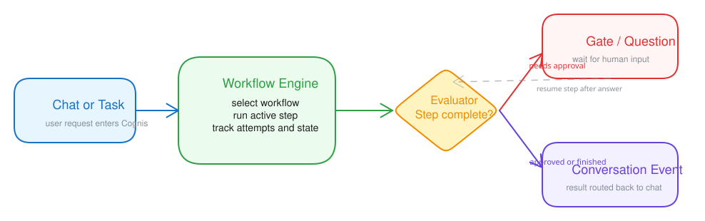

# Workflows

Workflows define how Cognis runs multi-step work. They are reusable templates that tasks and agents can use when a request should be broken into explicit stages instead of one direct response.

## Where workflows appear

- `Workflows` in the main navigation opens the workflow editor.
- `Tasks` use workflows to execute queued or background work.
- `Schedules` use workflows to create recurring background work.
- Agent settings can choose default workflows or limit which workflows an agent may use.

## What a workflow contains

Each workflow defines:

- workflow identity and description
- ordered steps
- step type and prompts
- step deliverables authored via `write_deliverable`
- optional evaluation or revision behavior
- loop and gate behavior
- optional agent overrides per step

The workflow editor is designed for operators and advanced users. Most end users can start with existing workflows and only change them when they need a more structured execution path.

## Common workflow patterns

- `direct` style flows for simple work
- plan -> execute -> review flows for larger tasks
- gated steps that pause for human approval
- loops that retry or revise a step until it satisfies the evaluator

## Creating a workflow

Open `Workflows` and either:

- create a new workflow from scratch
- duplicate an existing workflow
- import workflow YAML into the editor

You can then define metadata, edit steps, preview the pipeline diagram, and save the workflow.

On mobile, a sticky action bar at the bottom of the screen keeps `Save` one tap away even at the end of a long step editor. Other actions (New, Duplicate, Export YAML, Delete) are behind the `Actions` button on the same bar. Each step has up/down arrows for reorder, and every `?` help icon opens on tap.

The main chat agent can also manage workflows directly when you want to stay in conversation instead of using the editor. In that case, the agent should inspect the existing workflow first, keep changes minimal, and avoid mutating workflows that are already referenced by active tasks.

## YAML import and export

The workflow editor supports YAML import and export so you can:

- review a workflow definition outside the UI
- keep workflow definitions in version control
- copy a workflow between environments

## Workflow execution in tasks

When a task runs with a workflow, Cognis records:

- the active step
- step attempts and deliverable versions
- evaluator decisions
- pauses for gates or questions
- final completion or failure state

### Deliverables by default

Workflow steps use deliverables by default.

- A **deliverable** is the typed artifact a step writes with `write_deliverable`.
- Deliverables are used for evaluator review, downstream step context, task detail UI, and final workflow output.
- A workflow can produce many step deliverables, but only one final deliverable is externally delivered for the run.
- Free-text assistant messages during workflow execution are reasoning or progress, not the canonical artifact.

This makes deliverables useful for more than just the final user-facing message. They are the stable artifacts that let multi-step workflows stay inspectable and evaluable.

Exception: `system:direct` keeps the normal chat behavior, so direct chat replies still come from the assistant message instead of `write_deliverable`.

Task results are delivered back into the conversation flow, with the chosen final deliverable treated as the canonical workflow result.

## Tips

- Start simple. Only add evaluation loops or gates when the work truly needs them.
- Prefer short, explicit step instructions over long multi-purpose prompts.
- Use the task detail view to learn how a workflow behaves before making it more complex.
