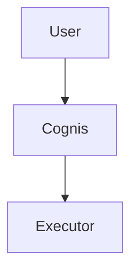

# Cognis: Document Generation and Report Delivery

## Overview

Cognis needs a first-class way for agents to produce rich user-facing documents
such as design docs, research reports, incident summaries, proposals, and audit
packages. The output must be a durable artifact that can be delivered back into
 conversations and external channels as a real file, not just as pasted text.

This spec defines a `document_generate` tool that renders Markdown or HTML/CSS
into PDF, supports inline assets, preserves source files for revision, and
delivers the final document through the existing artifact and channel systems.

The design goal is agent usability, not just renderer correctness. The normal
workflow must be one tool call for a simple report, while still supporting
advanced reports with generated images, Mermaid diagrams, local executor files,
and remote web assets.

## Goals

1. Let an agent generate a polished PDF from Markdown or HTML/CSS in a single
   tool call.
2. Support inline assets from Cognis artifacts, executor-local files, and remote
   URLs.
3. Support Mermaid diagrams in phase 1.
4. Preserve source content and render metadata so the document can be revised
   later.
5. Deliver the generated PDF back to the user as a real channel attachment when
   the channel supports files, with a public Cognis URL fallback when it does
   not.
6. Make the feature work for direct turns and for background task results.
7. Use only public Cognis artifact URLs for user-facing or channel-facing
   delivery.

## Non-Goals

1. Native Excalidraw rendering in the document tool. Excalidraw remains a
   separate skill and can be used by rendering to a local file or Cognis
   artifact that is then embedded as an asset.
2. DOCX generation in v1.
3. Unrestricted generic "upload any file to artifact store" as an LLM-facing
   tool.
4. Arbitrary authenticated remote asset fetching in v1.

## Why A High-Level Tool

The LLM should not need to compose a report by writing temp files with `bash`
and then uploading them manually. That is brittle, difficult to validate, and
too low-level for normal report generation.

Instead, Cognis should expose a high-level `document_generate` tool that:

1. accepts source content or a source reference,
2. resolves inline assets,
3. renders a PDF,
4. stores the result in the artifact store,
5. returns attachment metadata for channel delivery.

An escape hatch for publishing arbitrary local files may be added later as a
separate constrained tool, but it is not the primary report-generation path.

## User Stories

### Simple Report

The agent researches a topic, writes Markdown, calls `document_generate`, and
returns a PDF design document to the user in chat or Signal.

### Rich Design Doc

The agent generates an architecture image with `image_generate`, references the
returned artifact in the report, adds Mermaid diagrams, and produces a polished
PDF with custom CSS.

### Local Exploration Report

The agent uses executor tools (`bash`, browser automation, screenshots,
filesystem tools) and then builds a report from local files on the executor.

### Background Task Delivery

A delegated worker completes a long-running report in the background and the PDF
is delivered back into the originating conversation or preferred channel.

## Execution Model

`document_generate` MUST be an **executor-native** tool, not a controller-local
builtin handler.

Reasons:

1. local file support requires executor filesystem access,
2. Mermaid rendering requires executor-side CLI/process access,
3. WeasyPrint and related rendering dependencies are better isolated to the
   executor environment,
4. agents often create supporting files during research on the executor.

This is a deliberate exception from current image-tool behavior. Image generation
can remain controller-side because it delegates to a provider and does not need
local file access. Document generation is fundamentally a local rendering task.

## Tool Contract

### Tool Name

`document_generate`

### Input Schema

The schema MUST stay compact to reduce optional-field overfilling by models.

Required semantics:

1. `input_format`: `markdown` or `html`
2. exactly one source:
   - `content`
   - `source_path`
   - `source_artifact_id`

Optional fields:

1. `title`
2. `filename`
3. `css`
4. `template`
5. `page_size`
6. `orientation`
7. `assets`
8. `append_pdf_assets`

### Recommended Shape

```json
{
  "type": "object",
  "properties": {
    "input_format": {"type": "string", "enum": ["markdown", "html"]},
    "content": {"type": "string"},
    "source_path": {"type": "string"},
    "source_artifact_id": {"type": "string"},
    "title": {"type": "string"},
    "filename": {"type": "string"},
    "css": {"type": "string"},
    "template": {"type": "string", "enum": ["default", "design_spec", "report"]},
    "page_size": {"type": "string", "enum": ["A4", "Letter"]},
    "orientation": {"type": "string", "enum": ["portrait", "landscape"]},
    "append_pdf_assets": {"type": "boolean"},
    "assets": {
      "type": "array",
      "items": {
        "type": "object",
        "properties": {
          "name": {"type": "string"},
          "artifact_id": {"type": "string"},
          "path": {"type": "string"},
          "url": {"type": "string"},
          "alt": {"type": "string"},
          "caption": {"type": "string"},
          "mime_type": {"type": "string"}
        },
        "required": ["name"]
      }
    }
  },
  "required": ["input_format"]
}
```

Validation rules:

1. exactly one of `content`, `source_path`, `source_artifact_id` must be set,
2. each asset must specify exactly one of `artifact_id`, `path`, or `url`,
3. empty optional strings and collections must be stripped before execution,
4. output format is fixed to PDF in v1.

## Supported Authoring Modes

### Markdown

Markdown is the default authoring mode for agents. It is easier for models to
write, debug, and revise. Markdown mode should support at least:

1. headings,
2. paragraphs,
3. ordered and unordered lists,
4. tables,
5. fenced code blocks,
6. blockquotes,
7. inline images via asset references,
8. fenced Mermaid blocks.

### HTML/CSS

HTML is the advanced mode for high-fidelity layouts. The tool must support raw
HTML input plus optional CSS overrides. This mode is necessary for premium
reports, proposals, and branded deliverables.

## Asset Model

Assets are named inputs that the source document can reference.

### Supported Asset Sources In V1

1. `artifact_id` — preferred and safest.
2. `path` — executor-local file path.
3. `url` — unauthenticated remote HTTP(S) asset.

### Reference Syntax

Markdown:

```md

```

HTML:

```html

```

The renderer resolves `asset:<name>` using the `assets` array.

### Relative Local Files

If `source_path` is used, relative file references in the source document MUST
resolve relative to the source file directory. This makes standard Markdown
authoring work naturally when the agent writes a local `.md` file first.

### Companion Assets

Some assets cannot or should not be inlined into the PDF, such as ZIP files,
CSVs, and non-renderable binaries. The tool may return them as companion
attachments alongside the final PDF.

## Mermaid Support

Phase 1 MUST support Mermaid.

### Markdown Mermaid Blocks

The renderer should recognize fenced Mermaid blocks:

```md

```

### Rendering Strategy

1. Render Mermaid to SVG on the executor if the Mermaid CLI is available.
2. Embed the SVG inline into the generated HTML before WeasyPrint runs.
3. If Mermaid rendering is unavailable, fail clearly with an actionable error.

Mermaid support is part of v1 because diagrams are a core report use case.

## Excalidraw Handling

Native Excalidraw parsing is out of scope for v1.

Recommended workflow:

1. use the Excalidraw skill to render SVG or PNG locally,
2. include the rendered file via `path`,
3. or publish it as an artifact and include it via `artifact_id`.

This keeps `document_generate` focused while still supporting Excalidraw-based
reports in practice.

## Rendering Pipeline

The executor-side pipeline is:

1. normalize arguments,
2. load source from `content`, `source_path`, or `source_artifact_id`,
3. resolve all assets,
4. preprocess Markdown and Mermaid,
5. convert Markdown to HTML if needed,
6. apply template CSS and optional custom CSS,
7. render HTML to PDF with WeasyPrint,
8. save output bundle to Cognis artifact storage,
9. return attachment metadata and a structured textual result.

## Internal Artifact Publish Path

Because `document_generate` is executor-native, the executor MUST be able to
publish generated outputs back to the controller artifact store.

This is an internal runtime capability, not an LLM-facing tool.

### Requirement

Add an executor-to-controller artifact publish mechanism for generated files and
document sidecars.

Possible implementation shapes:

1. extend executor WebSocket RPC with an internal `artifact.publish` method,
2. or provide an internal controller endpoint authenticated by executor token.

The mechanism must support:

1. binary content upload,
2. namespace, object id, and filename,
3. content type,
4. owner email,
5. optional artifact metadata recording.

The tool MUST NOT return raw PDF bytes through normal tool output.

## Document Bundle Storage

Store each generated document as a bundle under a dedicated namespace such as
`documents`.

Recommended layout:

1. `documents/doc_<id>/document.pdf`
2. `documents/doc_<id>/source.md` or `source.html`
3. `documents/doc_<id>/style.css` when used
4. `documents/doc_<id>/manifest.json`

The bundle preserves enough information for future revision or regeneration.

### Manifest Fields

At minimum:

1. title,
2. input format,
3. template,
4. source provenance,
5. resolved assets,
6. render warnings,
7. generation timestamp,
8. page count if available.

## Public Artifact URLs

All user-facing and channel-facing attachment URLs MUST use Cognis public signed
URLs, never backend-native MinIO or S3 presigned URLs.

This requirement applies to:

1. `document_generate` output,
2. task result attachments,
3. conversation message attachment serialization,
4. channel delivery payloads.

The controller-facing artifact URL is the only URL shape that works reliably
across controller-hosted adapters, executor-hosted adapters, and mixed network
topologies.

## Output Contract

The tool returns:

1. a structured textual summary in `ToolResult.output`,
2. one primary attachment for the generated PDF,
3. optional companion attachments for non-inline assets when requested.

Example summary payload:

```json
{
  "document_id": "doc_a1b2c3",
  "pdf_artifact_id": "docpdf_a1b2c3",
  "filename": "cognis-design-spec.pdf",
  "url": "https://cognis.example.com/api/v1/artifacts/content/documents/doc_a1b2c3/document.pdf?...",
  "source_artifact_id": "docsrc_a1b2c3",
  "warnings": [],
  "assets_used": ["architecture", "timeline"]
}
```

Attachment metadata MUST include:

1. artifact id,
2. public URL,
3. MIME type,
4. filename,
5. size.

## Channel Delivery

The existing channel delivery path should be reused.

### Channels That Support Files

These adapters already have generic file/media support and should send the PDF
as a file attachment when given a valid public URL and MIME type:

1. Signal,
2. Telegram,
3. Slack,
4. Discord,
5. WhatsApp,
6. Matrix,
7. BlueBubbles.

### Channels With Link Fallback

1. Google Chat should send a link fallback for PDFs.
2. IRC should send a filename/link note.

### Combined Delivery

When a channel supports both text and attachments, the default behavior should
be to send the report text and attachment together in one outbound message when
the adapter can do so.

## Background Task Delivery

This feature is not complete unless background task results can carry document
attachments.

### Current Gap

Direct turn completion can now carry attachments, but task result delivery is
still summary-centric.

### Required Design

Persist generated attachments in `task.result_data`, then propagate them through:

1. workflow step completion,
2. task completion persistence,
3. task result event publication,
4. follow-up conversation injection,
5. channel follow-up delivery.

This avoids a DB migration in v1 while making delegated-worker reports useful.

## Security and Safety

### Remote URL Assets

Remote URL fetching MUST enforce:

1. `http` or `https` only,
2. timeout,
3. maximum bytes,
4. redirect limit,
5. MIME allowlist,
6. no authenticated fetches in v1.

### Local Path Assets

Local paths are resolved on the executor and inherit the same trust boundary as
other executor filesystem tools.

### HTML/CSS Safety

WeasyPrint does not execute JavaScript, but the renderer should still ignore or
strip active script content and control how external assets are resolved.

### Limits

Enforce explicit limits for:

1. source length,
2. number of assets,
3. total embedded asset bytes,
4. final PDF size.

## Dependencies

V1 requires:

1. WeasyPrint,
2. a Markdown parser suitable for tables and fenced blocks,
3. Mermaid CLI on executors that enable Mermaid report rendering.

These dependencies belong on the executor environment used for document
generation.

## API and Model Changes

### Tooling

1. Add a new executor-native tool definition for `document_generate`.
2. Register its handler in executor runtime construction.

### Artifact Support

1. Add internal executor-to-controller artifact publish support.
2. Reuse public signed URLs for all user-facing references.

### Task Results

1. Store attachment metadata in `task.result_data`.
2. Extend task follow-up delivery to carry attachments.

## Testing Requirements

### Unit Tests

1. Markdown content -> PDF.
2. HTML content + CSS -> PDF.
3. `source_path` resolution.
4. `source_artifact_id` resolution.
5. asset resolution from `artifact_id`.
6. asset resolution from `path`.
7. asset resolution from `url`.
8. Mermaid block rendering.
9. public Cognis URL generation.
10. attachment metadata returned.
11. task result attachment persistence.

### Integration Tests

1. direct chat generates PDF and Signal receives it,
2. delegated worker generates PDF and delivery returns to the originating
   conversation,
3. Telegram sends the PDF as a document,
4. Google Chat falls back to a link,
5. remote asset timeout and size rejection work as expected.

## Rollout Plan

### Phase 1

1. executor-native `document_generate`,
2. Markdown and HTML input,
3. WeasyPrint rendering,
4. assets from artifact id, path, and URL,
5. Mermaid support,
6. public artifact URLs,
7. direct-turn attachment delivery.

### Phase 2

1. background task attachment delivery,
2. source artifact regeneration flow,
3. richer templates and polish.

### Phase 3

1. constrained `artifact_publish` escape hatch,
2. advanced diagram workflows,
3. extra output formats if needed.

## Recommendation

Implement `document_generate` as an executor-native high-level tool with
artifact, path, and URL asset support in v1. Support Mermaid immediately.
Treat Excalidraw as a separate render-to-file workflow that feeds into the
document tool through local files or Cognis artifacts.

Most importantly, do not treat document generation as finished until the final
PDF can travel through the same direct-turn and background-task delivery paths
that users rely on in real conversations and channels.
